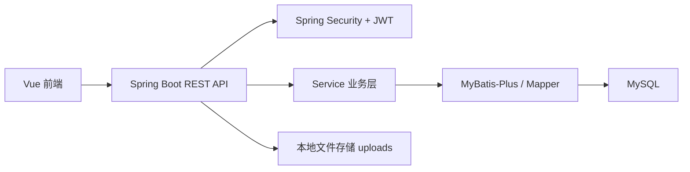

# 家政服务预约平台系统介绍

## 1. 系统概述

本系统是一个围绕“家政服务预约”场景实现的全栈 Web 平台，参考 TaskRabbit 的预约与履约模式，结合课程设计/毕业设计需求，构建了一个支持普通用户、服务人员、管理员三类角色协同运作的家政服务预约平台。

系统当前已经形成完整业务闭环，覆盖：

- 用户注册、登录、浏览服务、预约下单、支付、订单跟踪、评价、售后
- 服务人员注册、资质申请、审核通过后接单、服务过程记录、完工提交
- 管理员对用户、服务项目、资质审核、订单、售后、权限、报表和日志的统一管理

---

## 2. 功能模块划分

当前系统可以归纳为 **12 个一级功能模块**。

### 2.1 账号认证与权限模块

负责系统登录、注册、JWT 鉴权、角色划分与权限控制。

主要能力：

- 支持手机号或用户名登录
- 支持普通用户、服务人员、管理员三类角色
- 基于 Spring Security + JWT 的无状态认证
- 支持角色权限配置与菜单权限控制

对应实现：

- 后端：`auth`、`config`、`admin` 权限相关模块
- 前端：登录页、注册页、权限配置页、路由守卫

### 2.2 门户首页与服务展示模块

负责前台首页、服务项目展示、服务人员推荐与服务详情展示。

主要能力：

- 首页展示热门服务项目
- 展示推荐服务人员
- 服务项目和服务人员都支持图片展示
- 支持查看服务人员详情、评分、服务标签、可预约信息

### 2.3 用户中心模块

负责普通用户的个人信息管理、常用地址管理、收藏管理和工作台展示。

主要能力：

- 用户资料维护
- 头像上传
- 常用地址簿管理
- 地址默认项管理
- 地图选点设置地址
- 我的收藏
- 用户数据中心

### 2.4 地图选址与地址管理模块

负责用户地址的地图选择、坐标回填和坐标持久化。

主要能力：

- 地址可通过地图搜索或地图点选
- 保存经纬度到数据库
- 地址可回显“已定位”状态
- 预约页和地址簿可复用同一套地图选址组件

### 2.5 服务预约与支付模块

负责预约下单、预约时段展示、订单创建与支付流程。

主要能力：

- 可预约时段按具体时间段展示
- 预约表单支持服务人员、地址、时间、备注等信息填写
- 订单应付金额计算与支付状态管理
- 演示级支付流程与支付记录保存

### 2.6 订单协同履约模块

负责用户与服务人员共同推进订单状态。

主要能力：

- 用户下单
- 服务人员接单
- 用户确认预约安排
- 服务人员开始服务
- 服务人员提交完工
- 用户确认完工
- 订单评价

该模块不是服务人员单方面推进，而是采用“用户 + 服务人员协同推进”的状态流转方式。

### 2.7 服务人员资质申请模块

负责服务人员提交资质与服务信息，管理员审核后才能正式接单。

主要能力：

- 服务人员注册后填写资质信息
- 上传资质文件与相关证明材料
- 服务人员未审核通过时无法接单
- 审核通过后自动开放工作台接单能力

### 2.8 服务人员工作台模块

负责服务人员查看订单、处理订单、上传过程记录、查看消息与经营数据。

主要能力：

- 服务人员数据中心
- 待接单/服务中/待用户确认等订单处理
- 服务过程记录上传
- 服务沟通消息
- 营业额、流水、订单状态统计

### 2.9 消息中心与订单沟通模块

负责站内通知和围绕订单的即时沟通。

主要能力：

- 用户端消息中心
- 服务人员端消息中心
- 管理员消息中心
- 用户端订单沟通
- 服务人员端订单沟通
- 通知一键全部标记已读

消息中心和订单沟通已拆分为独立入口，不再混合在同一页面中。

### 2.10 售后与评价模块

负责订单完成后的评价反馈和售后处理。

主要能力：

- 订单评价
- 售后申请
- 售后附件上传
- 管理员售后处理与结果记录

### 2.11 管理后台治理模块

负责管理员对系统关键业务的统一管理。

主要能力：

- 用户管理
- 服务项目管理
- 服务人员资质审核
- 订单监管
- 售后管理
- 权限配置
- 操作日志查看
- 报表导出

### 2.12 数据中心与统计分析模块

负责管理员和服务人员的数据可视化展示。

主要能力：

- 营业额统计
- 日流水、本月流水
- 已支付订单统计
- 订单状态结构图
- 服务成交结构图
- 最近营业额流水

当前管理员端和服务人员端均已具备独立数据中心。

---

## 3. 三端功能结构

### 3.1 普通用户端

普通用户端主要包含：

- 首页
- 服务人员列表
- 服务人员详情
- 预约下单
- 我的订单
- 我的收藏
- 消息中心
- 订单沟通
- 个人资料
- 地址簿

### 3.2 服务人员端

服务人员端主要包含：

- 工作台首页
- 资质材料填写与提交
- 订单处理
- 消息中心
- 订单沟通
- 数据中心

### 3.3 管理员端

管理员端主要包含：

- 运营看板
- 消息通知
- 订单监管
- 用户管理
- 服务项目管理
- 资质审核
- 售后处理
- 操作日志
- 报表导出
- 权限配置

---

## 4. 技术栈说明

### 4.1 后端技术栈

- **Java 17**
- **Spring Boot 3.3.2**
- **Spring Security**
- **JWT（jjwt）**
- **MyBatis-Plus 3.5.7**
- **MySQL**
- **Spring Validation**
- **JDBC**
- **Knife4j / Swagger OpenAPI**

后端特点：

- 使用 Spring Security + JWT 实现认证授权
- 使用 MyBatis-Plus 实现数据访问与分页
- 使用 `schema.sql + 启动初始化器` 方式维护库表和演示数据
- 使用本地文件存储实现图片与附件上传

### 4.2 前端技术栈

- **Vue 3**
- **Vue Router 4**
- **Vite 6**
- **Element Plus**
- **ECharts**
- **Leaflet**

前端特点：

- 使用 Vue Router 实现多端路由隔离
- 使用 Element Plus 构建后台与表单组件
- 使用 ECharts 完成数据中心图表展示
- 使用 Leaflet + OpenStreetMap 完成地图选址
- 使用组合式 API 与工具层进行页面逻辑复用

---

## 5. 架构设计

## 5.1 总体架构

系统采用典型的前后端分离架构：

- 前端：Vue 3 单页应用，负责页面渲染、交互、状态展示
- 后端：Spring Boot REST API，负责认证、业务处理、数据访问、文件上传
- 数据库：MySQL，负责用户、订单、资质、消息、支付、售后等业务数据持久化
- 文件系统：本地 `uploads` 目录，负责头像、资质附件、售后凭证等文件存储

整体链路如下：



### 5.2 前端架构设计

前端采用“布局层 + 页面层 + 组件层 + API 层 + 工具层”的组织方式。

#### 布局层

当前共有 5 套布局：

- PublicLayout：前台公共页
- AuthLayout：登录注册页
- UserLayout：普通用户工作台
- WorkerLayout：服务人员工作台
- AdminLayout：管理员后台

#### 页面层

按角色拆分为：

- `views/consumer`
- `views/auth`
- `views/user`
- `views/worker`
- `views/admin`

#### 公共组件层

用于复用：

- 图表组件
- 消息中心组件
- 地图地址选择组件
- 分页组件
- 订单沟通组件
- 附件展示组件

#### API 层

前端 API 进行了模块化拆分，例如：

- 认证 API
- 订单 API
- 用户 API
- 后台 API
- 收藏 API
- 上传 API

#### 工具层

工具层主要负责：

- 订单状态中文化
- 预约时段格式化
- 权限与角色判断
- 图表数据组装
- 支付状态显示

### 5.3 后端架构设计

后端整体采用“Controller -> Service -> Mapper -> Database”的分层模式。

#### Controller 层

负责对外提供 REST 接口，例如：

- `AuthController`
- `OrderController`
- `WorkerOrderController`
- `AdminUserController`
- `WorkerApplicationController`

#### Service 层

负责业务逻辑，例如：

- 订单状态推进
- 资质审核
- 售后处理
- 权限装配
- 数据中心统计

#### Mapper 层

使用 MyBatis-Plus 的 `BaseMapper` 与分页插件完成数据库读写。

#### DTO / Entity 层

- Entity 用于数据库实体映射
- DTO 用于接口输入输出

#### Config 层

负责全局配置：

- SecurityConfig：安全配置
- WebConfig：CORS 与静态资源映射
- MybatisPlusConfig：分页插件
- OpenApiConfig：Swagger/Knife4j 文档

#### Bootstrap / Initializer 层

负责：

- 老数据库兼容补字段
- 初始化角色权限
- 初始化演示数据
- 初始化业务扩展表结构

这种设计使系统在持续迭代时能较稳定地兼容旧数据结构。

---

## 6. 权限与安全设计

系统采用 **Spring Security + JWT + 角色权限码** 的方式实现认证与授权。

### 6.1 角色划分

- USER：普通用户
- WORKER：服务人员
- ADMIN：管理员

### 6.2 权限控制方式

- 登录后签发 JWT
- 请求通过过滤器解析 Token
- 接口通过角色和权限码控制访问
- 前端菜单和路由根据权限动态显示

### 6.3 访问控制特点

- 未登录用户不能访问工作台
- 服务人员未完成资质审核时不能接单
- 管理员功能由权限配置页统一控制

---

## 7. 数据库设计概况

当前数据库脚本中共包含 **23 张核心数据表**。

主要分为 7 类：

### 7.1 用户与权限类

- `sys_user`
- `sys_role`
- `sys_user_role`
- `sys_permission`
- `sys_role_permission`

### 7.2 用户资料类

- `user_profile`
- `user_address`

### 7.3 服务与服务人员类

- `service_category`
- `worker_profile`
- `worker_application`
- `worker_application_attachment`

### 7.4 订单与支付类

- `booking_order`
- `booking_order_payment`
- `booking_order_progress`
- `order_review`
- `booking_order_service_record`
- `booking_order_service_record_attachment`

### 7.5 售后类

- `order_after_sale`
- `order_after_sale_attachment`

### 7.6 收藏与消息类

- `favorite_worker`
- `user_notification`
- `order_message`

### 7.7 运维治理类

- `operation_log`

数据库设计已经基本覆盖完整业务闭环。

---

## 8. 核心业务流程

### 8.1 用户预约流程

1. 用户注册并登录
2. 浏览服务人员
3. 选择服务时间与地址
4. 提交预约订单
5. 完成支付
6. 等待服务人员接单
7. 确认预约安排
8. 服务完成后确认完工
9. 进行评价或发起售后

### 8.2 服务人员接单流程

1. 服务人员注册
2. 填写资质与服务信息
3. 上传资质文件
4. 管理员审核
5. 审核通过后进入工作台
6. 接单、开工、上传服务记录、提交完工

### 8.3 管理员监管流程

1. 审核服务人员资质
2. 管理用户与服务项目
3. 查看订单与支付情况
4. 处理售后工单
5. 配置权限
6. 查看日志与导出报表

---

## 9. 页面与交互设计特点

当前前端整体设计风格为：

- 多端隔离布局
- 中文化界面
- Apple 风格中性色搭配
- 轻毛玻璃效果
- 动态背景氛围
- 卡片式信息结构
- 固定侧边栏与导航栏
- 表单按字段类型优化输入方式
- 图表与数据卡片可视化展示

同时系统也做了多项可用性优化：

- 登录支持手机号/用户名双模式
- 服务项目和服务人员支持图片展示
- 订单详情在当前页面抽屉展开
- 通知支持一键全部标记已读
- 地址可地图选择并保存坐标
- 预约时段显示具体时间段

---

## 10. 当前项目目录结构

### 10.1 后端目录

```text
backend/
  housekeeping-server/
    src/main/java/com/housekeeping/
      admin/
      aftersale/
      auth/
      common/
      config/
      dashboard/
      favorite/
      home/
      message/
      notification/
      order/
      upload/
      user/
      worker/
      bootstrap/
    src/main/resources/
  sql/schema.sql
```

### 10.2 前端目录

```text
frontend/
  web/
    src/
      api/
      components/
      composables/
      constants/
      layouts/
      router/
      stores/
      utils/
      views/
        admin/
        auth/
        consumer/
        user/
        worker/
```

---

## 11. 当前系统优势

当前系统的主要优势包括：

- 三端业务闭环完整
- 权限体系清晰
- 数据结构较完整
- 支持图表分析与报表导出
- 支持地图选址与文件上传
- 页面结构和角色隔离清楚
- 适合毕业设计展示与答辩说明

---

## 12. 当前仍可继续增强的方向

虽然系统已经接近完整，但如果继续向“商用级”演进，还可以继续增强：

- 接入真实微信支付/支付宝
- 完善自动化测试
- 引入对象存储替代本地文件存储
- 接入短信/微信/邮件通知
- 继续做前端分包与性能优化
- 增强日志审计和异常监控能力

---

## 13. 结论

当前家政服务预约平台已经具备较完整的系统架构、清晰的功能模块划分和稳定的三端业务闭环。系统不仅满足了预约平台的基础需求，也覆盖了资质审核、支付、消息、售后、权限管理、数据分析等较完整的业务场景，已经能够作为毕业设计、课程设计或项目演示系统进行展示。
