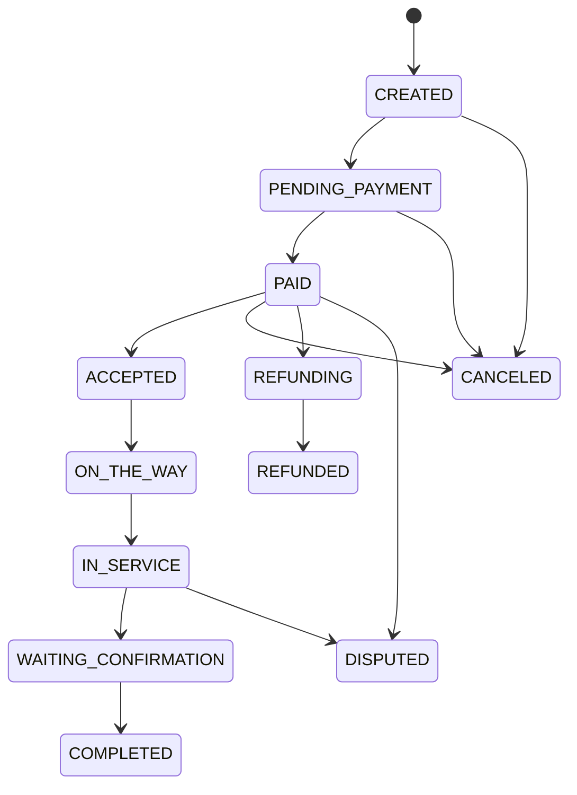

# Spring Boot + Vue 复刻 Taskrabbit 的可行性方案

## 1. 文档目标

本文面向当前项目 `housekeeping`，目标是给出一套“参考 Taskrabbit 业务模式与交互结构”的可落地方案，使用：

- 后端：Spring Boot
- 前端：Vue
- 场景：本地生活 / 家政 / 上门服务撮合平台

本文不是简单讲“怎么做一个官网”，而是从产品、架构、数据模型、接口设计、实施步骤、风险点几个维度，分析怎样做出一个可上线、可扩展的版本。

## 2. 先说结论：这件事可行，但建议按阶段做

如果你的目标是“完全照搬 Taskrabbit 全量能力”，工作量非常大，因为它本质上不是展示站，而是一个多角色撮合交易平台，至少包含：

- 用户端下单
- 服务者端接单
- 平台端审核与风控
- 即时聊天
- 日程管理
- 支付结算
- 评价体系
- 售后与取消规则
- 风险控制与实名认证

所以更现实的路线是：

1. 先做 `MVP`：完成核心成交闭环
2. 再做 `V2`：增强任务撮合、评价、取消、退款、营销
3. 最后做 `V3`：智能推荐、动态定价、多城市、多语言、风控系统

结论上，这个项目非常适合用 `Spring Boot + Vue 3` 来做，技术上没有明显阻碍。真正的难点不在“页面复刻”，而在“交易规则、状态流转、支付结算、角色协同”。

## 3. 对 Taskrabbit 的业务拆解

基于 Taskrabbit 公开页面与帮助中心信息，截至 `2026-03-26` 可观察到的核心业务结构包括：

- 首页突出服务分类，如家具组装、安装、搬家、清洁、户外帮助、家居维修等
- 用户先选服务，再筛选服务者（价格、技能、评价）
- 支持预约时间，最快可当天上门
- 任务内支持聊天、支付、打赏、评价
- 平台强调担保、审核、客服支持
- 费用结构包含服务者报价、平台服务费，以及平台保障/支持相关费用
- 存在取消费、报销、发票/账单、任务状态流转等平台规则

这说明你要复刻的不是一个单页官网，而是一个典型的“双边平台”：

- C 端：雇主 / 客户
- B 端：服务者 / 阿姨 / 维修工 / 安装师傅
- P 端：平台管理后台

## 4. 建议你复刻的范围

### 4.1 可以复刻的

- 信息架构
- 服务分类导航
- 首页营销布局
- 服务者列表与详情页思路
- 下单流程
- 订单状态机
- 平台担保、评价、聊天、支付这类能力

### 4.2 不建议直接照搬的

- 品牌名、Logo、文案、图片素材
- 原站 UI 细节的逐像素复制
- 原站定价规则与条款文本
- 原站业务政策原文

建议做法是：

- 复刻“业务模型”和“交互骨架”
- 自己设计品牌视觉和页面文案
- 将 Taskrabbit 作为竞品样板，而不是直接做镜像站

## 5. 适合当前项目的产品定位

如果你项目名叫 `housekeeping`，那我建议不要从“全品类万能跑腿平台”起步，而是先聚焦一个更容易成交的方向：

### 方案 A：家政保洁平台

适合先做：

- 日常保洁
- 深度保洁
- 开荒保洁
- 家电清洗
- 收纳整理

优点：

- 用户理解成本低
- 标准化程度较高
- 服务流程相对稳定

### 方案 B：家庭维修/安装平台

适合先做：

- 家具组装
- 灯具安装
- 窗帘/置物架/电视挂架安装
- 简单水电维修
- 搬运与重物挪动

优点：

- 更接近 Taskrabbit 的爆款分类
- 页面展示更容易做出“即时服务”的感觉

### 方案 C：综合到家服务平台

包括：

- 保洁
- 搬家
- 安装
- 维修
- 陪诊/代办

优点：

- 平台想象空间大

缺点：

- 早期系统复杂度高
- 审核、履约、定价都更难

如果你是个人或小团队，我建议从 `方案 B` 或 “B + 少量保洁” 开始，最接近 Taskrabbit 的用户心智，也最容易做出复刻感。

## 6. 推荐的系统总体架构

建议采用前后端分离架构：

```text
Vue Web/H5
   |
   | HTTPS / REST / WebSocket
   v
Spring Boot API Gateway / BFF
   |
   |-- 用户与认证模块
   |-- 服务分类模块
   |-- 服务者模块
   |-- 订单任务模块
   |-- 报价与计费模块
   |-- 聊天消息模块
   |-- 支付结算模块
   |-- 评价与投诉模块
   |-- 后台管理模块
   |
   +-- MySQL / PostgreSQL
   +-- Redis
   +-- Elasticsearch（可选）
   +-- OSS / MinIO
   +-- WebSocket / MQ
```

## 7. 技术选型建议

## 7.1 后端

- `Java 21`
- `Spring Boot 3.x`
- `Spring Web`
- `Spring Security`
- `Spring Data JPA` 或 `MyBatis-Plus`
- `Redis`
- `MySQL 8` 或 `PostgreSQL`
- `Spring WebSocket`
- `Quartz` 或 `XXL-Job` 做定时任务
- `MinIO` 或云 OSS 做图片/证件/案例图存储

### 后端为什么这样选

- Spring Boot 适合做强业务状态流转
- Security 能较稳地处理多角色登录
- Redis 适合验证码、会话、缓存、抢单锁
- WebSocket 适合任务聊天和消息提醒
- 定时任务适合超时取消、自动完结、退款检查

## 7.2 前端

- `Vue 3`
- `Vite`
- `Vue Router`
- `Pinia`
- `Axios`
- `Element Plus` 或 `Naive UI`
- `Sass`

如果你要同时兼顾移动端，建议：

- PC 端：Vue 3 管理后台 + 官网
- 移动端：Vue 3 + 响应式布局，或者额外做 `uni-app`

## 7.3 第三方能力

中国本地化落地时建议接入：

- 登录：短信验证码、微信登录
- 支付：微信支付、支付宝
- 地图：高德地图 / 腾讯地图
- 实名认证：阿里云 / 腾讯云实名认证
- OCR：身份证识别、营业资质识别
- IM：如果不自研，可用环信、融云、腾讯云 IM

## 8. 角色设计

建议系统至少有 4 类角色：

- `Client`：下单用户
- `Worker`：服务者
- `Admin`：平台管理员
- `Operator`：客服/审核人员

后续还可以扩展：

- `CityManager`：城市运营
- `Finance`：财务结算

## 9. 核心业务模块

### 9.1 用户与认证

功能：

- 手机号注册登录
- 验证码登录
- 微信快捷登录
- 用户基础资料
- 地址簿管理
- 实名认证

服务者额外功能：

- 身份证信息
- 技能标签
- 服务区域
- 服务时间日历
- 资质证书上传
- 接单状态开关

### 9.2 服务分类

功能：

- 一级类目：保洁 / 安装 / 搬家 / 维修
- 二级类目：电视安装、灯具安装、沙发清洗等
- 分类详情页
- 分类价格说明
- 常见问题

这是首页和搜索流量的入口，也是后续 SEO 的核心。

### 9.3 服务者展示与筛选

功能：

- 服务者列表
- 条件筛选：价格、距离、评分、已完成单量、可预约时间
- 服务者详情页
- 案例展示
- 用户评价列表

排序建议：

- 综合推荐
- 价格最低
- 评分最高
- 距离最近
- 最近可约

### 9.4 下单与预约

功能：

- 选择服务分类
- 填写需求描述
- 上传图片
- 选择上门地址
- 选择预约时间
- 指定服务者或系统推荐
- 提交订单

这里可以设计成两种模式：

- `指定技师下单`
- `发布需求，等待服务者报价/抢单`

如果你要更像 Taskrabbit，建议优先做第一种，即“用户选人后直接约”。

### 9.5 订单/任务系统

订单是整个系统的核心。

建议订单状态至少包括：

- `CREATED`：已创建，待确认
- `PENDING_PAYMENT`：待支付
- `PAID`：已支付
- `ACCEPTED`：服务者已接单
- `ON_THE_WAY`：服务者出发中
- `IN_SERVICE`：服务中
- `WAITING_CONFIRMATION`：待用户确认完成
- `COMPLETED`：已完成
- `CANCELED`：已取消
- `REFUNDING`：退款中
- `REFUNDED`：已退款
- `DISPUTED`：争议中

需要配套：

- 状态变更日志
- 操作人记录
- 超时处理
- 取消原因
- 售后申请

### 9.6 平台聊天

这是 Taskrabbit 类产品很重要的体验点。

功能建议：

- 订单内一对一聊天
- 文本消息
- 图片消息
- 系统通知消息
- 订单状态卡片
- 已读未读

注意：

- 聊天必须与订单强关联
- 平台应保留聊天记录，便于纠纷处理

### 9.7 支付与结算

建议先做“平台统一收款”模式。

流程：

1. 用户支付到平台
2. 订单完成后平台结算给服务者
3. 平台抽取服务费

费用模型建议：

- 服务费：平台按百分比抽成
- 基础上门费：可选
- 夜间/节假日加价：可选
- 材料费/报销费：按规则补录
- 优惠券抵扣：后续再加

如果你想参考 Taskrabbit 的规则，可以在自己系统中设计：

- 平台服务费
- 平台保障费
- 取消费
- 报销审核

但要注意这些规则要本地化，不要直接复制原站条款。

### 9.8 评价与信用体系

功能：

- 星级评分
- 文本评价
- 图片评价
- 标签评价
- 追评
- 差评申诉

服务者侧要有：

- 评分均值
- 完成单量
- 取消率
- 响应时长
- 准时率

### 9.9 管理后台

后台建议至少包含：

- 用户管理
- 服务者审核
- 分类管理
- 订单管理
- 支付与退款管理
- 投诉仲裁
- Banner 与首页装修
- 内容管理
- 数据统计看板

## 10. 最小可行版本 MVP 该做什么

我建议你第一期只做“能闭环成交”的能力，不要一开始就做太全。

### MVP 必须有

- 首页
- 服务分类页
- 服务者列表页
- 服务者详情页
- 下单页
- 我的订单
- 订单详情
- 用户登录
- 服务者登录
- 管理后台基础版
- 支付能力
- 简单消息通知

### MVP 可以暂时不做

- 实时聊天可先用轮询消息替代
- 智能推荐
- 优惠券系统
- 多城市运营
- 多语言
- 发票系统
- 提现风控
- 复杂仲裁系统

这样你可以在较短周期先做出一个“像真的平台”的版本。

## 11. 页面设计建议

你要复刻 Taskrabbit，最容易让用户产生“像”的感觉，其实来自页面结构而不只是配色。

### 11.1 首页结构

建议首页包含：

- 顶部导航
- 主视觉 Banner
- 服务分类入口
- 热门项目
- 平台优势
- 服务流程
- 用户评价
- 常见问题
- 底部页脚

推荐的模块顺序：

1. 顶部搜索/分类快捷入口
2. 热门服务卡片
3. 平台信任背书
4. 服务流程三步走
5. 优质服务者展示
6. 用户评价
7. CTA 引导下单

### 11.2 服务列表页

左侧/顶部筛选：

- 价格区间
- 评分
- 距离
- 可预约时间
- 服务标签

右侧列表卡片：

- 头像
- 名称
- 星级
- 成交单量
- 每小时价格 / 起步价
- 核心技能标签
- 最近可预约时间
- 立即预约按钮

### 11.3 服务者详情页

内容：

- 基础资料
- 评分与评论
- 服务介绍
- 案例图
- 服务区域
- 日历可预约时间
- 价格说明
- 立即预约

### 11.4 下单页

步骤式表单：

1. 选择服务
2. 填写需求
3. 上传图片
4. 选择地址和时间
5. 确认价格
6. 支付提交

## 12. 数据库核心表设计建议

以下是建议的核心表，不要求你一期全部实现，但表关系最好一开始就想清楚。

### 12.1 用户相关

- `user`
- `user_profile`
- `user_address`
- `user_auth`
- `user_role`

### 12.2 服务者相关

- `worker_profile`
- `worker_skill`
- `worker_service_category`
- `worker_certificate`
- `worker_portfolio`
- `worker_schedule`
- `worker_service_area`
- `worker_stats`

### 12.3 分类与内容

- `service_category`
- `service_item`
- `service_pricing_rule`
- `banner`
- `faq`

### 12.4 订单相关

- `task_order`
- `task_order_item`
- `task_order_status_log`
- `task_order_cancel`
- `task_order_refund`
- `task_order_extra_fee`

### 12.5 交易相关

- `payment_record`
- `refund_record`
- `settlement_record`
- `worker_income_account`

### 12.6 互动相关

- `conversation`
- `message`
- `review`
- `review_reply`
- `complaint`

### 12.7 运营管理

- `audit_log`
- `operation_log`
- `notification`
- `coupon`

## 13. 后端模块拆分建议

如果你后续项目会做大，建议从一开始按模块拆，不一定要立刻上微服务，但可以先做“单体模块化”。

建议包结构：

```text
com.housekeeping
  |- common
  |- auth
  |- user
  |- worker
  |- category
  |- order
  |- payment
  |- message
  |- review
  |- admin
  |- infra
```

### 推荐原因

- 初期仍然是一个 Spring Boot 单体，开发效率高
- 后期可以将 `order`、`payment`、`message` 独立出去
- 比一开始强行微服务更稳

## 14. 核心接口设计示例

下面给你一套比较合理的 REST API 分组思路。

### 14.1 用户端

- `POST /api/auth/sms/send`
- `POST /api/auth/login/sms`
- `GET /api/user/profile`
- `PUT /api/user/profile`
- `GET /api/user/addresses`
- `POST /api/user/addresses`

### 14.2 分类与首页

- `GET /api/home/banners`
- `GET /api/home/hot-services`
- `GET /api/categories`
- `GET /api/categories/{id}`
- `GET /api/services/{categoryId}/workers`

### 14.3 服务者

- `GET /api/workers/{id}`
- `GET /api/workers/{id}/reviews`
- `GET /api/workers/{id}/schedule`
- `POST /api/worker/apply`
- `PUT /api/worker/profile`

### 14.4 订单

- `POST /api/orders`
- `GET /api/orders/{id}`
- `GET /api/orders/my`
- `POST /api/orders/{id}/cancel`
- `POST /api/orders/{id}/confirm`
- `POST /api/orders/{id}/start`
- `POST /api/orders/{id}/finish`

### 14.5 支付

- `POST /api/pay/orders/{id}/create`
- `POST /api/pay/callback/wechat`
- `POST /api/pay/callback/alipay`
- `GET /api/pay/orders/{id}/status`

### 14.6 消息

- `GET /api/conversations`
- `GET /api/conversations/{id}/messages`
- `POST /api/conversations/{id}/messages`

### 14.7 评价

- `POST /api/reviews`
- `GET /api/reviews/order/{orderId}`

### 14.8 后台

- `GET /admin/users`
- `GET /admin/workers`
- `POST /admin/workers/{id}/approve`
- `GET /admin/orders`
- `POST /admin/orders/{id}/intervene`

## 15. 订单状态机一定要提前设计

很多此类项目后期难维护，不是因为代码不行，而是因为状态乱。

建议先画状态机，再写代码。

可以参考如下：



每个状态变更都要校验：

- 谁能操作
- 是否满足前置条件
- 是否要记录日志
- 是否要发通知
- 是否影响退款结算

## 16. 推荐的前端工程划分

建议至少拆成两个前端：

- `frontend/web`：用户端官网 + 下单端
- `frontend/admin`：平台管理后台

如果你想做服务者端，可再加：

- `frontend/worker`：服务者工作台

如果暂时只做一个 Vue 项目，也建议按路由分区：

- `/` 用户端
- `/worker` 服务者端
- `/admin` 管理端

但从长期看，后台和前台最好分开部署。

## 17. 你可以直接参考的页面清单

### 用户端

- 首页
- 分类页
- 分类详情页
- 服务者列表页
- 服务者详情页
- 下单页
- 支付页
- 订单列表页
- 订单详情页
- 评价页
- 个人中心

### 服务者端

- 入驻申请页
- 资料编辑页
- 技能设置页
- 排班日历页
- 订单管理页
- 收入页
- 评价页

### 管理后台

- 登录页
- 工作台
- 用户管理
- 服务者审核
- 分类管理
- 订单管理
- 财务管理
- 内容管理
- 统计分析

## 18. 开发阶段建议

## 第一阶段：产品原型与数据模型

目标：

- 明确业务范围
- 定好页面流
- 确认数据库实体

输出物：

- 原型图
- ER 图
- 接口清单
- 状态机文档

## 第二阶段：后端基础能力

目标：

- 登录鉴权
- 分类与服务者接口
- 下单与订单状态流
- 支付能力

输出物：

- 可联调 API
- 数据库脚本
- Swagger/OpenAPI 文档

## 第三阶段：前端用户端

目标：

- 首页与列表页
- 服务者详情
- 下单与支付
- 我的订单

输出物：

- 可演示的用户闭环

## 第四阶段：服务者端与后台

目标：

- 服务者入驻审核
- 接单与履约
- 平台后台管理

输出物：

- 平台运营闭环

## 第五阶段：优化与上线

目标：

- 性能优化
- 日志监控
- 安全加固
- 正式部署

## 19. 工期预估

以下按“1 名后端 + 1 名前端 + 1 名产品/兼 UI”的轻量团队估算。

### 做 MVP

- 原型与设计：1 到 2 周
- 后端开发：3 到 5 周
- 前端开发：3 到 5 周
- 联调测试：1 到 2 周

总计：

- 大约 `8 到 14 周`

### 做较完整版本

包括：

- 实时聊天
- 退款仲裁
- 服务者审核
- 排班系统
- 评价系统
- 财务结算

总计：

- 大约 `4 到 6 个月`

## 20. 最大的技术难点

### 20.1 不是 UI，而是交易链路

最容易低估的是：

- 订单状态流转
- 取消与退款规则
- 服务者接单/爽约/超时
- 支付回调幂等
- 聊天记录存证

### 20.2 服务者排班和可预约时间

这比普通电商复杂，因为它不是“库存”，而是“时间库存”。

需要处理：

- 时间段冲突
- 假期设置
- 地理位置与通勤时间
- 连单能力

### 20.3 费用规则

价格可能由多个因素组成：

- 基础价
- 小时费
- 服务费
- 夜间加价
- 材料费
- 报销
- 优惠券

所以一开始要把“价格明细模型”抽象清楚。

## 21. 安全与合规建议

如果你真要上线，这部分必须认真做。

### 必做

- 手机号验证
- JWT 或 Token 鉴权
- 权限隔离
- 防刷验证码
- 支付回调签名校验
- 文件上传安全校验
- 操作日志
- 敏感数据脱敏

### 上线前强烈建议

- 实名认证
- 用户协议与隐私政策
- 服务者协议
- 退款与取消规则说明
- 风险订单人工介入能力

## 22. 部署建议

推荐一开始就按可上线方式部署：

- `Nginx` 反向代理
- `Spring Boot` 单体部署
- `MySQL`
- `Redis`
- `MinIO` 或云 OSS

如果并发上来后再扩展：

- API 多实例
- Redis 独立部署
- MQ 异步化通知
- ES 做搜索

## 23. 推荐目录结构

结合你当前仓库，我建议后续整理成：

```text
housekeeping/
  |- backend/
  |   |- housekeeping-server
  |   |- sql/
  |   |- docs/
  |
  |- frontend/
  |   |- web/
  |   |- admin/
  |   |- worker/   (可选)
  |
  |- doc/
  |   |- taskrabbit-springboot-vue-implementation-plan.md
```

## 24. 最推荐的落地路径

如果让我直接给你一个最务实的路线，我建议这样做：

### 第一步：先做“安装/维修”版 Taskrabbit

只做 4 个分类：

- 家具组装
- 灯具安装
- 电视/挂架安装
- 基础维修

### 第二步：做最短成交闭环

- 用户选分类
- 看师傅列表
- 预约时间
- 下单支付
- 师傅接单
- 服务完成
- 用户评价

### 第三步：再补平台能力

- 聊天
- 退款
- 审核
- 数据统计
- 优惠券

这样最容易在有限时间内做出一个“真正可用”的版本。

## 25. 你现在就可以开始的实施清单

建议按下面顺序推进：

1. 明确你要做“保洁版”还是“安装维修版”
2. 先画 10 个核心页面原型
3. 定数据库核心表
4. 定订单状态机
5. 开发登录、分类、服务者、下单、订单 5 个核心模块
6. 前端先实现首页、列表页、详情页、下单页、订单页
7. 最后接支付和后台

## 26. 最后的建议

这类项目成功的关键不是“把 Taskrabbit 首页复刻得多像”，而是：

- 能不能形成完整交易闭环
- 能不能把订单状态和支付规则处理稳定
- 能不能让服务者端真的可操作

所以技术实现上应遵循一个原则：

`先复刻业务闭环，再复刻视觉细节。`

如果你愿意，我下一步可以继续直接帮你输出两份文档到 `doc` 目录：

- `MVP 功能清单 + 开发排期`
- `数据库表设计初稿 + 字段建议`

这样你就可以马上进入建库和编码阶段。

## 27. 参考信息

以下信息用于本文分析参考，访问时间为 `2026-03-26`：

- Taskrabbit 首页：[https://www.taskrabbit.com/](https://www.taskrabbit.com/)
- Taskrabbit 帮助中心服务费说明：[https://support.taskrabbit.com/hc/en-us/articles/204411610-What-s-the-Taskrabbit-Service-Fee](https://support.taskrabbit.com/hc/en-us/articles/204411610-What-s-the-Taskrabbit-Service-Fee)
- Taskrabbit 帮助中心保障/支持费用说明：[https://support.taskrabbit.com/hc/en-us/articles/204940570-What-s-the-Taskrabbit-Trust-Support-Fee](https://support.taskrabbit.com/hc/en-us/articles/204940570-What-s-the-Taskrabbit-Trust-Support-Fee)
- Taskrabbit 取消政策：[https://support.taskrabbit.com/hc/en-us/articles/360035010972-Cancellation-Policy](https://support.taskrabbit.com/hc/en-us/articles/360035010972-Cancellation-Policy)
- Taskrabbit 发票/报销规则参考：[https://support.taskrabbit.com/hc/en-us/articles/34799128396301-The-Taskrabbit-Invoicing-Policy](https://support.taskrabbit.com/hc/en-us/articles/34799128396301-The-Taskrabbit-Invoicing-Policy)
