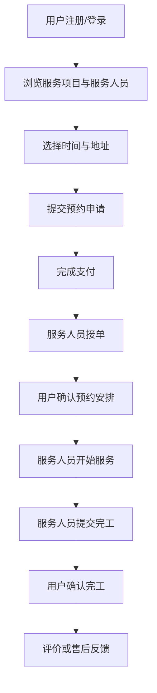
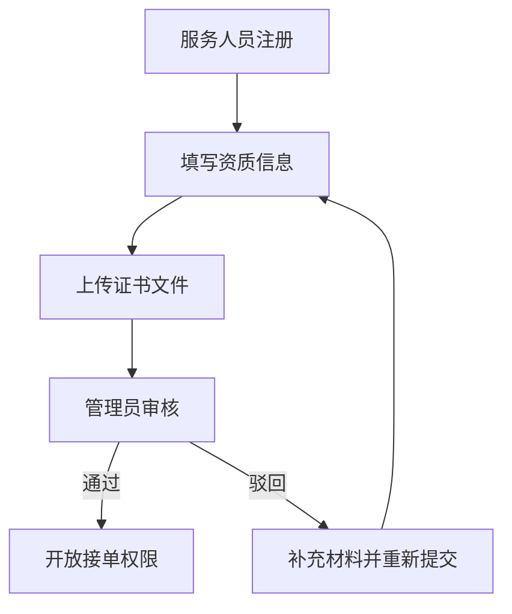
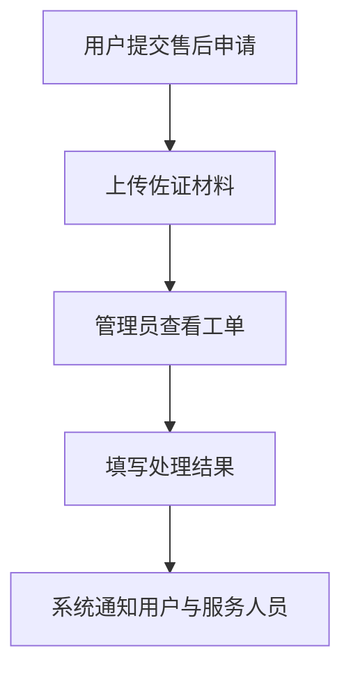
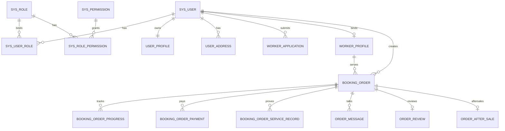

# 基于 Java Web 的家政服务预约平台的设计与实现

## 摘要

随着互联网技术的不断发展和居民生活服务需求的持续升级，家政服务行业正在由传统的线下撮合、电话沟通和熟人介绍模式向平台化、数字化、全过程可追踪模式转变。传统家政服务模式在信息透明度、预约效率、服务质量控制、服务人员资质管理、订单过程追踪以及售后保障等方面存在明显不足，已经难以满足现代用户对于服务效率、安全保障和服务体验的综合要求。为了缓解家政服务信息不对称、预约流程繁琐、订单管理混乱以及平台监管效率不高等问题，本文围绕家政服务预约业务场景，设计并实现了一套基于 Java Web 技术体系的家政服务预约平台。

本系统采用 B/S 架构，后端以 Spring Boot 为核心开发框架，结合 Spring Security、JWT、MyBatis-Plus 与 MySQL，实现多角色身份认证、权限控制、业务处理和数据持久化；前端以 Vue 3 为核心框架，配合 Vue Router、Element Plus、ECharts 和 Leaflet，完成了多角色工作台、数据可视化、地图选址和交互式表单等功能。系统围绕普通用户、家政服务人员和平台管理员三类角色展开设计，重点实现了多角色用户管理、家政服务项目管理、在线预约与下单、订单进度跟踪与沟通、评价反馈与售后管理、数据统计与分析六大核心功能模块，并进一步扩展实现了角色权限配置、操作日志、支付模拟、站内通知、订单沟通、地图地址管理、报表导出等支撑能力，形成了从服务浏览、预约、支付、履约、评价到售后反馈的较完整线上闭环。

在系统实现过程中，本文重点解决了多角色权限边界清晰划分、服务人员资质审核通过后方可接单、订单状态由用户与服务人员共同推进、支付状态与订单流转联动、服务过程记录上传、地图选址回填与地址持久化、后台治理与统计分析统一管理等关键问题。测试结果表明，系统能够较稳定地完成任务书和开题报告中提出的主要功能目标，界面交互较清晰，业务链路较完整，适合作为家政服务预约平台方向的毕业设计原型系统。

**关键词：** 家政服务预约平台；Spring Boot；Vue；MyBatis-Plus；MySQL；订单协同

## Abstract

With the continuous development of Internet technology and the increasing demand for residential life services, the housekeeping service industry is shifting from traditional offline referrals and phone-based coordination to a platform-oriented, digital, and fully traceable service model. Traditional housekeeping services often suffer from poor information transparency, inefficient booking procedures, weak service quality control, irregular qualification management of workers, lack of order traceability, and inadequate after-sales support. In order to address these issues, this paper designs and implements a housekeeping service reservation platform based on a Java Web technology stack.

The system adopts a B/S architecture. The back end is built on Spring Boot and integrates Spring Security, JWT, MyBatis-Plus, and MySQL to support multi-role authentication, authorization control, business processing, and data persistence. The front end is developed with Vue 3 and enhanced by Vue Router, Element Plus, ECharts, and Leaflet to realize multi-role workbenches, data visualization, map-based address selection, and interactive forms. The platform is designed for three roles, namely ordinary users, housekeeping workers, and platform administrators. It mainly implements six core modules, including multi-role user management, housekeeping service project management, online reservation and ordering, order progress tracking and communication, review and after-sales management, and data statistics and analysis. In addition, the system also extends supporting capabilities such as role-permission configuration, operation logging, simulated payment, in-site notifications, order conversations, map-based address management, and report export, thus forming a relatively complete online service loop from service browsing and booking to payment, fulfillment, review, and after-sales handling.

During implementation, this paper focuses on solving key issues such as clear role-based access boundaries, qualification-based order acceptance for workers, collaborative order progression by both users and workers, linkage between payment status and order flow, upload of service process records, map-based address backfilling and persistence, and unified governance and statistical analysis in the background system. Test results show that the platform can stably accomplish the main functional goals proposed in the project proposal and task specification, and that it demonstrates clear interaction design, relatively complete business workflows, and good suitability as a graduation project prototype for housekeeping reservation services.

**Key words:** housekeeping reservation platform; Spring Boot; Vue; MyBatis-Plus; MySQL; collaborative order workflow

## 目 录

- 第1章 绪论
- 第2章 开发技术和框架
- 第3章 系统需求分析
- 第4章 系统设计
- 第5章 系统实现
- 第6章 系统测试
- 第7章 总结与展望
- 参考文献

---

## 第1章 绪论

### 1.1 研究背景

随着居民收入水平的提高和家庭消费结构的不断升级，家政服务已经逐渐从单一的清洁服务扩展到保洁、收纳、家电清洗、母婴护理、老人陪护等多种生活场景。用户对家政服务的需求已经不再只是“找到人完成任务”，而是希望在服务预约之前就能够清楚地了解服务项目、收费标准、服务人员经验、资质情况以及平台保障措施，并在服务过程中实时掌握订单状态与服务进度，在服务完成后得到评价反馈和售后处理支持。

然而，传统家政服务行业长期依赖线下介绍、电话联系和人工登记，信息割裂严重，主要体现在以下几个方面。第一，雇主与服务人员之间存在明显的信息不对称，雇主很难在预约前准确判断服务人员的专业水平与真实资质。第二，预约流程缺乏统一平台支持，服务时间、服务地址、费用构成等关键信息往往通过聊天工具或电话零散沟通，效率低且容易出错。第三，订单在创建之后缺少全过程透明追踪，服务何时开始、服务过程是否规范、服务是否完成等关键节点常常无法被完整记录。第四，平台管理者难以对服务人员入驻、资质审核、服务质量监管和售后纠纷处理进行统一治理。第五，数据统计与经营分析能力薄弱，无法有效支持平台运营决策。

基于以上现实背景，构建一套面向普通用户、家政服务人员和平台管理员三类角色的家政服务预约平台，具有较强的实际应用价值。该平台不仅能够帮助用户便捷筛选服务项目与服务人员、在线预约与支付、查看订单进度和发起售后，也能够帮助服务人员规范接单流程、上传服务过程记录、展示自身专业能力，同时还能帮助管理员完成平台治理、审核与统计分析工作。对于软件工程毕业设计而言，此类平台系统覆盖面广、功能完整、业务逻辑清晰，能够充分体现学生在需求分析、架构设计、数据库设计、前后端实现和系统测试等方面的综合能力。

### 1.2 研究意义

本课题的研究意义主要体现在实践意义与教学意义两个层面。

从实践意义来看，家政服务平台能够有效提升服务资源配置效率。普通用户可以直接通过平台完成服务筛选和预约，减少传统线下寻找服务人员所耗费的大量沟通成本；服务人员可以通过统一的资质申请与服务档案展示机制被平台规范管理；管理员则可以借助后台管理模块对服务项目、资质审核、订单监管、售后处理和数据统计进行集中化管理，从而提升整个平台运行效率与服务质量。

从教学意义来看，家政服务预约平台是一类典型的多角色 Web 系统。它既包含基础的注册登录、权限控制、数据库设计和后台管理等常见模块，也包含资质审核、订单协同推进、支付联动、服务记录、消息通知、地图选址和统计分析等较复杂的业务逻辑。因此，该课题非常适合作为软件工程专业毕业设计选题，能够完整体现从需求建模到工程落地的全过程。

### 1.3 国内外研究现状

从国外应用现状来看，以 TaskRabbit 为代表的本地生活服务平台已经发展出较为成熟的线上撮合和平台保障机制。国外平台通常强调三点：一是服务项目的分类清晰和服务人员信息展示透明，用户在预约前可以较充分地了解服务人员评分、完成量和服务范围；二是订单过程高度可追踪，用户和服务人员都可以通过平台明确服务安排和履约节点；三是平台在资质审核、消息沟通、评价反馈、支付担保和售后处理等环节中起到关键中介作用。  
这些平台说明，家政服务系统的核心已经不仅仅是“能预约”，而是“能透明地预约、能规范地履约、能完整地治理”。

从国内研究与实践来看，近年来围绕家政服务平台、生活服务预约系统、家政小程序、家政综合管理系统等方向的研究持续增多。已有研究多数关注于预约功能、移动端下单、服务人员匹配、用户评价和后台管理等内容，较多项目也采用 Spring Boot 与 Vue 作为主流技术方案。国内研究的普遍结论是：平台化管理能够有效提升家政服务的信息透明度和资源调度效率，尤其在服务项目展示、订单管理、评价反馈和数据统计方面具有明显优势。

但从已有系统的常见实现情况来看，仍然存在若干问题。第一，不少系统停留在展示型平台或基础 CRUD 管理系统层面，对真实履约过程中的资质审核、服务过程佐证和售后链路关注不足。第二，部分系统在角色权限划分方面较粗放，未能充分体现普通用户、服务人员和管理员之间的职责边界。第三，关于订单状态推进机制，很多系统仅体现为单方状态修改，而缺少用户与服务人员之间的共同确认机制。第四，对于消息通知、操作日志、报表导出和后台治理等平台化能力，已有系统往往实现不完整。

因此，结合国内外研究与平台实践经验，设计并实现一个既符合任务书要求、又更接近真实平台业务闭环的家政服务预约平台，仍然具有明显的研究与实践价值。

### 1.4 本文主要工作

结合开题报告、任务书和当前系统实现，本文主要完成了以下工作。

1. 对家政服务预约业务场景进行分析，明确普通用户、家政服务人员和平台管理员三类角色的核心职责与使用边界。
2. 确定系统采用基于 Java Web 的前后端分离技术路线，后端选用 Spring Boot、Spring Security、JWT、MyBatis-Plus 和 MySQL，前端选用 Vue 3、Element Plus、ECharts 和 Leaflet。
3. 围绕多角色用户管理、家政服务项目管理、在线预约与下单、订单进度跟踪与沟通、评价反馈与售后管理、数据统计与分析六大核心模块进行需求分析和系统设计。
4. 在系统实现中进一步加入角色权限配置、操作日志、报表导出、地图选址、消息通知、服务记录上传、支付模拟等支撑能力，使平台业务链路更加完整。
5. 对系统进行了功能测试、可用性测试和构建验证，并分析系统当前的优点、局限性及后续完善方向。

### 1.5 论文结构

为了清晰说明系统从需求到实现的全过程，本文结构安排如下。

1. 第一章为绪论，主要介绍课题背景、研究意义、国内外研究现状、本文主要工作与论文结构。
2. 第二章为开发技术和框架，介绍系统开发所采用的 B/S 模式、前后端分离、Token 认证、数据库以及相关前后端框架。
3. 第三章为系统需求分析，从可行性分析、功能性需求和非功能性需求三个层面论证系统开发的必要性和合理性。
4. 第四章为系统设计，重点说明系统整体架构、功能模块设计、数据库设计、权限设计和订单状态机设计。
5. 第五章为系统实现，结合当前项目实际实现情况，对注册登录、服务项目管理、在线预约、订单跟踪、售后处理和数据中心等模块进行详细说明。
6. 第六章为系统测试，对测试目的、测试过程和测试结果进行分析。
7. 第七章为总结与展望，对本文工作进行总结，并给出后续改进方向。

---

## 第2章 开发技术和框架

### 2.1 技术介绍

#### 2.1.1 B/S 模式

B/S 即 Browser/Server 模式，是当前 Web 应用开发最常见的系统架构之一。在该模式下，用户只需使用浏览器即可访问系统，无需单独安装客户端程序；服务器则负责处理业务逻辑、数据库访问、权限验证以及文件管理等核心功能。

相较于传统的 C/S 模式，B/S 模式具有以下优势。首先，使用门槛低，用户只需浏览器即可访问平台，适合普通用户、服务人员和管理员三类不同身份用户统一使用。其次，维护成本低，系统升级和功能变更主要集中在服务器端，客户端无需反复安装和更新。再次，扩展性较好，前端界面和后端接口可以独立扩展和迭代，更适合平台型系统的持续演进。对于本课题而言，B/S 模式能够较好满足毕业设计项目对跨角色访问、统一入口和快速演示部署的要求。

> [插图预留：图2-1 B/S 模式结构示意图。建议插入浏览器、前端页面、Spring Boot 接口和 MySQL 数据库之间关系图。]

#### 2.1.2 前后端分离

前后端分离是一种将前端页面渲染逻辑和后端业务逻辑彻底解耦的开发模式。前端通过 HTTP 请求调用后端接口，后端返回标准化 JSON 数据，前端再根据业务需要将数据渲染为页面内容。  
本系统采用前后端分离的方式开发，其优点主要体现在以下几个方面。

1. 前端和后端可以并行开发，提高整体开发效率。
2. 不同角色页面可以通过路由和布局隔离实现清晰划分。
3. 后端只需关注业务逻辑和数据处理，接口更加标准化。
4. 后续如需接入小程序、移动端或第三方系统时，可以复用现有后端接口。

在当前系统中，前端通过 Vue 3 + Vue Router 实现页面组织，后端通过 Spring Boot 提供 RESTful API，二者通过 Axios 风格的 HTTP 请求完成数据交互。

> [插图预留：图2-2 前后端分离交互图。建议插入前端页面请求后端 API 并访问数据库的流程图。]

#### 2.1.3 Token 认证

在前后端分离项目中，传统 Session 方案在跨页面状态维护和接口访问控制方面会带来一定复杂度，因此本系统采用基于 JWT 的 Token 认证机制。  
用户登录成功后，后端根据账号信息、角色信息和权限信息生成 JWT，并返回给前端。前端在后续请求受保护接口时，将 Token 通过请求头携带给后端，后端再通过 Spring Security 对 Token 进行解析和校验，从而识别当前请求用户的身份与权限范围。

采用 Token 认证机制的优点在于：一是更适合前后端分离项目的无状态认证场景；二是便于多角色接口统一鉴权；三是有利于前端根据不同角色渲染菜单和路由；四是能够与角色权限配置逻辑配合使用，实现更灵活的访问控制。

### 2.2 数据库与数据存储

#### 2.2.1 MySQL

MySQL 是本系统的核心数据库，主要用于存储用户账号、角色权限、服务项目、服务人员档案、资质申请、订单、支付记录、服务过程记录、评价、售后、消息通知和操作日志等业务数据。  
本系统使用 MySQL 的原因主要有以下几点。

1. MySQL 部署方便，适合课程设计和毕业设计环境。
2. 能够较好地支持多表关联、事务和分页查询需求。
3. 与 Java 生态集成成熟，便于通过 MyBatis-Plus 快速完成开发。
4. 对于本系统当前业务规模而言，性能和稳定性完全能够满足需求。

#### 2.2.2 本地文件存储方案

开题报告中虽然重点强调数据库设计，但结合当前系统业务实际，还必须解决头像、资质证书、服务过程照片和售后附件的存储问题。  
当前系统采用本地 `uploads` 目录作为文件存储方案，并通过后端统一将文件暴露为 `/uploads/**` 访问路径。这种方案实现简单、部署轻便、适合毕业设计环境。与此同时，系统在设计上已经为后续切换到对象存储保留了接口扩展空间。

#### 2.2.3 数据一致性设计

为了保证系统数据之间关联合理，本系统通过以下方式保证数据库一致性。

1. 角色、权限、用户之间使用关联表维护关系，保证授权关系清晰。
2. 用户与地址簿、服务人员与资质申请、订单与支付记录、订单与服务记录之间使用关联字段建立映射关系。
3. 关键业务表通过状态字段约束业务流转，例如资质状态、支付状态、订单状态、售后状态等。
4. 启动初始化器会自动检查必要字段和表结构，保证开发阶段数据库能够正常运行。

### 2.3 后端框架

#### 2.3.1 Spring Boot

Spring Boot 是本系统后端开发的基础框架。它采用约定优于配置的设计理念，能够快速搭建稳定的 Web 服务。系统中所有控制器、服务层、配置类和初始化器均基于 Spring Boot 组织。  
在具体实现中，Spring Boot 主要承担以下职责。

1. 提供 Web 服务运行环境和 REST 接口能力。
2. 集成 Spring Security、Validation、JDBC 等组件。
3. 支持通过配置文件完成数据库、JWT、上传目录和跨域等配置。
4. 便于分层组织代码，提高项目结构清晰度。

#### 2.3.2 MyBatis-Plus

根据任务书和开题报告要求，系统 DAO 层采用 MyBatis-Plus 实现数据访问。MyBatis-Plus 对 MyBatis 做了进一步封装，能够显著减少常规 CRUD 代码量，并提供较友好的条件构造器、分页插件和实体映射能力。  
本系统中，MyBatis-Plus 广泛应用于用户管理、服务项目管理、订单管理、消息通知、售后工单以及统计查询等模块，使开发效率得到明显提升。

#### 2.3.3 Spring Security

Spring Security 是系统实现权限控制的核心组件。系统通过 Spring Security 配合 JWT 过滤器，完成普通用户、服务人员和管理员三类角色的认证与授权。  
与简单的拦截器方案相比，Spring Security 更适合当前系统这样具备多角色、多接口、多菜单权限控制需求的平台型系统。尤其在后台治理和角色权限配置场景下，Spring Security 能够提供更加稳定、规范的权限框架支持。

### 2.4 前端框架

#### 2.4.1 Vue

Vue 3 是当前系统前端的核心框架。它支持组件化开发、响应式数据更新和灵活的路由管理，能够较好支撑多工作台、多角色、多页面的系统设计。  
在本系统中，普通用户端、服务人员端和管理员端分别组织为独立工作台页面，并通过 Vue Router 实现路由隔离。

#### 2.4.2 Element Plus 组件库

Element Plus 是当前系统主要使用的 UI 组件库，负责提供表单、表格、抽屉、对话框、标签、按钮、分页和菜单等常用组件。  
在家政服务预约平台中，后台管理页面、服务项目编辑表单、资质申请页面、订单详情抽屉、消息中心以及分页查询页面均依赖 Element Plus 实现统一交互风格。

#### 2.4.3 ECharts

ECharts 主要用于实现数据统计与分析模块中的图表展示。管理员和服务人员的数据中心页面均使用 ECharts 展示订单状态结构、营业额流水、服务成交分布、近 7 天趋势等信息。  
为了提高图表可读性，系统对订单状态分布图进行了紧凑化设计，将易拥挤的饼图调整为更适合展示的圆环图与图例组合形式。

#### 2.4.4 Leaflet

Leaflet 是系统地图选址能力的核心前端组件。当前系统支持在资料页和预约页中使用地图搜索、点击选点和位置回填来设置服务地址，并将经纬度同步保存到数据库中。  
该设计使得地址信息不再局限于纯文本输入，更符合真实预约平台的地址管理需求。

### 2.5 本章小结

本章围绕系统开发所使用的主要技术展开介绍，从 B/S 模式、前后端分离、Token 认证、MySQL 数据库、Spring Boot、MyBatis-Plus、Spring Security 到 Vue、Element Plus、ECharts 和 Leaflet，说明了系统各部分技术选型及其在项目中的具体作用。这些技术共同构成了当前家政服务预约平台的技术基础，也为后续需求分析、系统设计与模块实现奠定了技术支撑。

---

## 第3章 系统需求分析

### 3.1 可行性分析

#### 3.1.1 经济可行性

从经济角度看，本系统使用的核心技术和开发工具大多为开源软件，包括 Spring Boot、Vue、MyBatis-Plus、MySQL 和 ECharts 等，无需额外支付授权费用。项目开发和运行环境可以在个人计算机、MySQL 数据库和浏览器基础上完成，开发成本较低。  
对于毕业设计项目而言，该系统无需采购额外商业软件或昂贵硬件设备，即可完成开发、测试和演示，因此具备较好的经济可行性。

#### 3.1.2 技术可行性

从技术角度看，系统采用的技术方案成熟稳定。Spring Boot 能够快速提供 Web 服务能力，MyBatis-Plus 能够简化数据库访问实现，Spring Security + JWT 能够满足多角色认证和权限控制需求，Vue 3 与 Element Plus 能够支撑多角色前端页面实现，ECharts 与 Leaflet 则能够满足统计分析和地图选址功能要求。  
结合项目当前已经完成的前后端实现可以证明，本课题从技术上完全具备可实现性。

#### 3.1.3 法律可行性

从法律和规范角度看，家政服务预约平台在设计与实现中主要关注以下方面。  
第一，用户密码和身份信息不能以明文方式暴露或存储，系统当前采用加密存储和 JWT 鉴权机制进行保护。第二，服务人员资质材料属于敏感信息，平台应限制访问范围，仅授权管理员和申请人查看。第三，评价、售后和日志信息需要被规范记录，避免出现任意篡改和责任不清的情况。  
虽然当前系统仍是毕业设计原型产品，但在角色隔离、权限校验和日志记录层面已经体现出一定的合规设计思路，因此具备较好的法律可行性。

#### 3.1.4 运营可行性

从平台运营角度看，家政服务预约平台的运营可行性主要体现为：普通用户有明确的线上预约需求，服务人员有展示能力和获得订单的需求，平台管理员有统一审核、监管和统计的需求。系统通过多角色设计有效覆盖了这三类核心主体，从而具备较强的运营逻辑合理性。  
当前系统虽然未接入真实第三方商业能力，但作为原型平台，已经具备服务项目发布、用户预约、支付模拟、订单跟踪、售后反馈和数据统计等核心运营要素。

### 3.2 功能性需求分析

根据任务书和开题报告，系统的功能性需求主要分为以下六类。

#### 3.2.1 多角色用户管理功能

系统应支持普通用户、家政服务人员和平台管理员三种角色，并实现权限分级管理。  
普通用户需要完成注册登录、完善个人资料、维护地址和完成预约下单；家政服务人员需要完成账号注册、资质申请、服务类型关联、订单处理和服务记录上传；平台管理员则需要完成资质审核、用户管理、服务项目管理、订单监管和售后处理等工作。  
此外，开题报告中还要求实现角色权限配置页面和操作日志页面，因此系统还需要支持后台权限配置和关键操作留痕。

> [插图预留：图3-1 系统总用例图。建议插入普通用户、服务人员、管理员三类角色的用例图。]

#### 3.2.2 家政服务项目管理功能

管理员需要能够维护服务项目，包括服务类型、服务时长、收费标准、服务范围、适用场景、增值服务和展示图片等内容；用户则需要能够按照服务类型、价格区间、服务区域等条件进行筛选并分页浏览服务项目和服务人员。  
服务人员还需要能够在资质页中选择与自身能力匹配的服务类型。由此可见，服务项目管理模块既服务于后台配置，也服务于前台展示和服务人员服务关联。

> [插图预留：图3-2 服务项目管理业务关系图。建议插入管理员发布项目、前台展示、服务人员关联服务类型的关系图。]

#### 3.2.3 在线预约与下单功能

普通用户在选定服务项目和服务人员后，应能够选择服务时间、服务地址和预约备注，提交预约申请并完成支付。支付成功后系统需要自动生成订单，并明确展示服务内容、服务时间、费用构成和服务人员信息。  
任务书中还要求系统进行服务状态实时校验，当前系统通过服务人员资质校验、订单状态校验和可预约时段展示，在一定程度上实现了该要求。

#### 3.2.4 订单进度跟踪与沟通功能

系统应支持服务人员按节点更新服务状态，并上传服务过程照片作为进度佐证；用户能够实时查看订单当前状态、服务记录和沟通消息；管理员能够从后台统一监控订单处理情况。  
在当前系统中，订单沟通已经与消息中心拆分为独立页面，使得“订单业务信息”和“通知消息信息”结构更加清晰，符合任务书中“订单进度跟踪与沟通模块”的要求。

#### 3.2.5 评价反馈与售后管理功能

用户在服务完成后应能够对服务人员的服务态度、服务效果和专业水平进行评分与留言；同时平台还应设置售后反馈入口，使用户能够提交服务不满意、服务违规或需求变更等售后请求。  
管理员则需要能够查看售后列表、处理工单并记录结果。当前系统已经实现了售后附件上传、售后状态跟踪和处理结果回显。

#### 3.2.6 数据统计与分析功能

任务书和开题报告均强调平台运营统计和可视化展示能力。系统需要为管理员提供平台订单量、服务类型销量、服务人员接单量、客户满意度等核心数据；同时为服务人员提供订单状态、收入流水和营业额统计。  
当前系统通过 ECharts 实现图表展示，并支持部分报表导出功能。

### 3.3 非功能性需求分析

#### 3.3.1 安全性

系统需要保证用户身份安全、权限安全和数据安全。主要体现为：

1. 用户密码加密存储。
2. 前后端通过 JWT 进行身份校验。
3. 多角色接口通过 Spring Security 进行访问控制。
4. 关键操作保留日志记录。
5. 资质材料、服务记录和售后附件均通过受控路径进行访问。

#### 3.3.2 稳定性

平台应能够在普通演示环境下稳定运行，避免出现启动失败、数据读取异常和核心页面无法访问等问题。  
当前系统通过启动初始化器保障数据库字段完整，通过前后端构建验证保证工程可运行，并通过较清晰的分层结构降低维护复杂度，从而提升稳定性。

#### 3.3.3 可用性

系统界面应尽量简洁、易操作，减少用户学习成本。  
为此，当前系统在预约表单中使用具体时间段而非纯文本输入，在城市和地址选择中引入地图选址，在订单详情中采用当前页抽屉展开模式，在消息中心中支持一键全部标记已读，在数据中心中对图表布局进行紧凑化优化，这些设计都体现了对可用性的考虑。

#### 3.3.4 可扩展性

系统应支持后续接入真实支付网关、对象存储、外部通知和自动化测试能力。  
当前系统通过分层架构、模块化前端页面和清晰的数据库设计，为这些后续扩展保留了良好空间。例如，支付目前为模拟流程，但支付记录表和状态联动逻辑已经具备；上传目前为本地存储，但调用方式已能被对象存储替换。

### 3.4 系统流程分析

#### 3.4.1 用户预约流程



> [插图预留：图3-3 用户预约流程图。]

#### 3.4.2 服务人员资质审核与接单流程



> [插图预留：图3-4 服务人员资质审核流程图。]

#### 3.4.3 售后处理流程



> [插图预留：图3-5 售后处理流程图。]

### 3.5 本章小结

本章从可行性、功能性需求、非功能性需求和系统流程四个角度对家政服务预约平台进行了全面分析，明确了平台建设的必要性与可实现性，也进一步细化了任务书和开题报告中提出的核心需求。通过本章分析，可以为后续系统设计和模块实现提供清晰依据。

---

## 第4章 系统设计

### 4.1 系统整体架构设计

当前系统采用前后端分离的总体架构，前端使用 Vue 3 构建用户界面和工作台页面，后端使用 Spring Boot 提供 RESTful API，数据层使用 MySQL 存储业务数据，文件附件暂存于本地上传目录。  
从逻辑分层看，系统主要包括以下几个层次。

1. 表现层：普通用户端、服务人员端、管理员端以及登录注册页。
2. 控制层：负责接收前端请求并进行权限验证与参数校验。
3. 业务层：负责处理预约、支付、审核、售后和统计等核心业务逻辑。
4. 数据访问层：基于 MyBatis-Plus 实现数据库操作。
5. 数据存储层：MySQL 数据库和本地文件上传目录。

这种架构设计具有职责清晰、便于维护和便于扩展的优点，能够较好支撑平台型应用的多模块协同。

> [插图预留：图4-1 系统总体架构图。建议插入前端、后端、安全层、数据库和文件存储的关系图。]

### 4.2 系统功能模块设计

结合开题报告与任务书要求，系统功能可划分为六大核心模块和若干支撑模块。

#### 4.2.1 用户管理模块设计

用户管理模块负责普通用户、服务人员和管理员的身份接入与资料管理。对于普通用户，重点在于注册登录、个人资料维护、地址簿管理和订单使用；对于服务人员，重点在于账号注册、资质申请、服务类型绑定和工作台接单；对于管理员，重点在于对全平台用户进行筛选、查看和管理。  
该模块同时承担权限配置和日志记录支撑能力，是整个系统的基础模块。

#### 4.2.2 服务项目管理模块设计

服务项目管理模块主要由管理员使用，用于发布、编辑、删除和维护服务项目。服务项目不仅要描述名称和价格，还需要描述时长、服务范围、适用场景和增值服务，以便用户理解服务内容，也便于服务人员准确匹配自身服务能力。  
在当前实现中，该模块使用了更加合理的字段输入方式，例如标签输入、多选选择器和展示图片上传，而不是全部使用普通文本框。

#### 4.2.3 预约订单模块设计

预约订单模块是系统的核心交易模块，负责从预约申请到订单生成、支付、状态推进和详情展示的全过程管理。  
为了降低订单争议，系统在设计上强调三个原则：一是订单信息必须完整记录预约时间、服务地址、费用与备注；二是支付状态要与订单流转联动；三是订单状态推进必须具有明确责任主体。

#### 4.2.4 进度跟踪与沟通模块设计

该模块围绕订单生命周期设计。系统将订单状态分为待接单、已接单、用户已确认、服务中、待用户确认完工和已完成等状态，并要求用户与服务人员共同参与状态流转。  
同时，系统引入订单沟通和消息通知双通道：消息中心负责站内通知，订单沟通负责围绕具体订单的信息交流，从而增强履约过程透明度。

#### 4.2.5 评价售后模块设计

评价售后模块设计目标是保证平台在服务完成后仍然具备闭环能力。用户可以在服务完成后进行评分和留言；若对服务存在异议，则可提交售后申请并上传佐证材料。管理员则通过后台对售后工单进行分配和处理。  
该模块在平台治理中具有重要意义，它既承担服务质量反馈作用，也承担纠纷处理入口作用。

#### 4.2.6 数据统计与后台治理模块设计

数据统计与后台治理模块面向管理员与服务人员提供可视化数据中心，同时面向管理员提供用户管理、服务项目管理、资质审核、订单监管、售后处理、日志与报表等治理能力。  
该模块的存在使系统不再只是“可用的预约页面”，而是具备较完整的平台运维管理能力。

> [插图预留：图4-2 系统功能模块图。建议插入六大核心模块与支撑模块的结构图。]

### 4.3 数据库设计

#### 4.3.1 数据库概念模型设计

数据库概念模型围绕用户、服务人员、服务项目、订单和平台治理五大对象构建。用户与角色之间是多对多关系；用户与地址簿是一对多关系；服务人员与资质申请、一对一服务档案之间存在明确绑定关系；订单与支付、进度、服务记录、评价、售后和沟通消息之间存在多类关联关系。  
通过实体关系建模，可以保证系统业务对象之间的结构化映射关系明确，为后续数据库表设计和业务实现提供依据。



> [插图预留：图4-3 数据库实体关系图。]

#### 4.3.2 主要数据表设计

当前系统数据库的关键数据表包括：

| 表名 | 主要作用 |
| --- | --- |
| `sys_user` | 存储用户账号信息，支持手机号和用户名登录 |
| `sys_role` | 存储角色信息 |
| `sys_user_role` | 存储用户与角色关系 |
| `sys_permission` | 存储权限元数据 |
| `sys_role_permission` | 存储角色权限关系 |
| `user_profile` | 存储用户基础资料 |
| `user_address` | 存储用户地址簿和经纬度 |
| `service_category` | 存储服务项目分类信息 |
| `worker_profile` | 存储服务人员档案 |
| `worker_application` | 存储服务人员资质申请 |
| `worker_application_attachment` | 存储资质申请附件 |
| `booking_order` | 存储订单主信息 |
| `booking_order_payment` | 存储支付记录 |
| `booking_order_progress` | 存储订单进度记录 |
| `booking_order_service_record` | 存储服务过程记录 |
| `booking_order_service_record_attachment` | 存储服务过程附件 |
| `order_review` | 存储订单评价 |
| `order_after_sale` | 存储售后工单 |
| `order_after_sale_attachment` | 存储售后附件 |
| `favorite_worker` | 存储收藏关系 |
| `user_notification` | 存储站内通知 |
| `order_message` | 存储订单沟通消息 |
| `operation_log` | 存储后台关键操作日志 |

#### 4.3.3 核心表设计说明

在所有数据表中，`sys_user`、`worker_profile`、`booking_order` 和 `service_category` 是最核心的四类业务表。  
`sys_user` 负责统一账号管理；`worker_profile` 负责服务人员业务档案展示；`service_category` 负责服务项目配置；`booking_order` 则是连接普通用户、服务人员和平台业务流转的核心枢纽。围绕这四类核心表，系统再通过支付、进度、服务记录、评价、售后和通知等表扩展出完整业务链路。

### 4.4 权限与安全设计

为了满足开题报告中“多角色用户管理模块”“角色权限配置页面”和“操作日志页面”的要求，系统在安全设计上采用了如下策略。

1. 使用 Spring Security + JWT 进行统一认证和授权。
2. 将普通用户、服务人员和管理员划分为三个基础角色。
3. 在角色基础上进一步引入权限元数据和角色权限关系。
4. 对后台、用户端、服务人员端接口分别施加不同权限校验。
5. 对关键操作写入操作日志，包括资质审核、订单处理、服务项目管理和权限修改等行为。

这一设计既满足课程设计中对权限分级管理的要求，也使系统更接近真实平台的访问控制方式。

### 4.5 订单状态机设计

当前系统订单状态机设计如下：

1. `PENDING`：待接单  
2. `ACCEPTED`：已接单  
3. `CONFIRMED`：用户已确认预约安排  
4. `IN_SERVICE`：服务中  
5. `WAITING_USER_CONFIRMATION`：待用户确认完工  
6. `COMPLETED`：已完成

相较于仅由服务人员单方面推进状态的简单实现，当前系统特别强调“共同推进”原则：服务人员接单后，用户必须确认预约安排；服务人员完成服务后，用户还需要确认完工。该设计符合用户权益保障思路，也更符合任务书中关于订单进度跟踪和服务监管的要求。

> [插图预留：图4-4 订单状态流转图。]

### 4.6 本章小结

本章从整体架构、功能模块、数据库设计、安全权限和订单状态机等方面对家政服务预约平台进行了系统设计说明。通过本章可以看出，系统不仅从任务书出发完成了六大核心功能模块设计，也结合当前实现增加了权限配置、日志、支付模拟和地图选址等平台化支撑能力，为系统实现部分奠定了清晰的结构基础。

---

## 第5章 系统实现

### 5.1 开发环境

当前系统开发环境如下：

| 项目 | 说明 |
| --- | --- |
| 开发语言 | Java、JavaScript |
| 后端框架 | Spring Boot 3.3.2 |
| 前端框架 | Vue 3 |
| 数据访问框架 | MyBatis-Plus 3.5.7 |
| 安全框架 | Spring Security + JWT |
| 数据库 | MySQL |
| 前端组件库 | Element Plus |
| 图表库 | ECharts |
| 地图库 | Leaflet |
| 构建工具 | Maven、Vite |
| 开发工具 | IDEA / VS Code / PowerShell 环境 |
| 运行系统 | Windows 11 |

### 5.2 用户管理模块

#### 5.2.1 注册登录实现

系统支持普通用户和服务人员注册，也支持手机号或用户名两种登录方式。登录时，后端通过 Spring Security 对账号进行校验，并在登录成功后签发 JWT 令牌，前端保存该令牌用于后续接口访问。  
当前登录页进行了简洁化处理，只保留账号登录核心表单和体验账号入口，减少干扰信息，便于用户快速进入系统。

> [插图预留：图5-1 登录页面截图。]

> [插图预留：图5-2 注册页面截图。]

#### 5.2.2 个人信息管理实现

普通用户登录后，可以进入个人中心完善个人资料，包括头像、姓名、性别、所在城市、个人简介等信息。当前系统对字段类型做了优化，例如所在城市采用选择框加可搜索输入的形式，而不是单一纯文本框。  
这种设计能够减少用户输入错误并提高录入效率，也使系统界面更符合真实平台使用习惯。

> [插图预留：图5-3 用户个人资料页面截图。]

#### 5.2.3 地址簿与地图选址实现

用户地址簿模块支持新增、编辑、删除和设置默认地址。为了提升可用性，系统同时支持地图搜索、地图点击选点和当前位置回填，并将详细地址、城市和经纬度一并保存到数据库中。  
在预约页面中，用户可以直接从地址簿选择已有地址，也可以现场通过地图重新设置地址，实现地址信息的复用与灵活调整。

> [插图预留：图5-4 地址簿页面截图。]

> [插图预留：图5-5 地图选址对话框截图。]

#### 5.2.4 管理员用户管理实现

后台用户管理页面支持管理员按角色、姓名、手机号和状态筛选查看用户，并可识别其是否已绑定服务人员档案。该页面同时也是平台进行用户治理的重要入口。  
管理员还可以在后台查看服务人员是否已通过资质审核，从而实现平台级管理。

> [插图预留：图5-6 管理员用户管理页面截图。]

#### 5.2.5 角色权限配置与操作日志实现

系统实现了角色权限配置页面，用于展示和维护普通用户、服务人员和管理员的权限边界。当前页面已经将权限名称中文化，去除冗余英文权限码展示，使页面更加适合论文展示和后台使用。  
同时，系统通过操作日志页面集中记录关键操作，包括资质审核、订单处理、服务项目修改和权限变更等行为，方便管理员追踪平台操作历史。

> [插图预留：图5-7 角色权限配置页面截图。]

> [插图预留：图5-8 操作日志页面截图。]

### 5.3 家政服务项目管理模块

#### 5.3.1 服务项目发布与维护实现

服务项目管理页面支持管理员新增、编辑、删除和启停服务项目，配置字段包括服务类型、价格标签、服务时长、服务范围、适用场景、增值服务和展示图片。  
为了提高后台可用性，系统针对字段类型采用不同输入方式：如价格标签和标签类字段支持可创建选择器，服务范围和适用场景支持多值输入，展示图片支持上传和预览，避免全部使用文本框所带来的低效和错误率问题。

> [插图预留：图5-9 服务项目管理列表页面截图。]

> [插图预留：图5-10 新增/编辑服务项目表单截图。]

#### 5.3.2 服务项目前台展示实现

前台服务项目与服务人员列表页面支持图片展示，不再只依赖文字介绍。普通用户可查看项目名称、收费标签、服务标签和服务人员相关信息，并通过分页和筛选快速定位所需服务。  
服务项目展示图和服务人员展示图均支持后台自定义，增强了平台的可配置能力。

> [插图预留：图5-11 前台服务项目展示页面截图。]

#### 5.3.3 服务人员服务类型关联实现

服务人员在资质申请页面中可以从真实服务项目分类中选择自己能够承接的服务类型。系统已修复“新增服务项目后服务人员资质页无法读取新类型”的问题，保证后台服务项目和服务人员关联数据来源一致。  
该设计避免了前端写死分类带来的不一致问题，也更符合平台数据统一管理的要求。

> [插图预留：图5-12 服务人员资质申请页面中的服务类型选择截图。]

### 5.4 在线预约与下单模块

#### 5.4.1 预约申请页面实现

用户选定服务人员后进入预约页面，系统允许用户填写联系人、联系方式、服务地址、预约日期、具体时间段和服务备注。  
与早期简单文本录入不同，当前系统将预约时段细化为具体时间段展示，例如“08:00-10:00”“10:00-12:00”等，方便用户明确理解服务安排。此外，预约页还可直接调用地图选址组件，以便更准确设置服务地址。

> [插图预留：图5-13 在线预约页面截图。]

#### 5.4.2 支付模拟页面与支付联动实现

根据开题报告要求，系统实现了支付模拟流程。当前系统虽然尚未接入真实第三方支付网关，但已经具备完整的支付状态联动逻辑：订单创建后可进入支付流程，支付成功后更新支付状态并写入支付记录，之后订单才能继续推进。  
这种设计能够较真实地模拟平台交易过程，也为未来接入微信支付或支付宝沙箱环境提供了结构基础。

> [插图预留：图5-14 订单支付界面或支付弹窗截图。]

#### 5.4.3 订单生成与详情展示实现

支付完成后，系统生成唯一订单记录，明确展示服务内容、费用明细、预约时间、服务人员信息和当前状态。  
用户端与服务人员端订单列表页当前只显示简要信息，详细信息则在当前页通过抽屉展开，避免跳转到新页面造成流程割裂。抽屉中可以看到支付状态、进度记录、服务记录、评价和售后等完整信息。

> [插图预留：图5-15 用户订单列表页面截图。]

> [插图预留：图5-16 订单详情抽屉截图。]

### 5.5 订单进度跟踪与沟通模块

#### 5.5.1 服务人员进度更新实现

任务书要求服务人员能够按节点更新服务状态并上传服务过程照片作为进度佐证。当前系统已经实现该能力，服务人员可以在工作台中完成接单、开始服务、提交完工以及上传签到记录、过程照片和完工凭证等操作。  
这些信息会同步进入订单详情页面，供用户查看。

> [插图预留：图5-17 服务人员订单处理页面截图。]

#### 5.5.2 用户进度查看实现

用户端订单详情可以查看当前订单状态、服务过程记录、上传附件和进度说明，同时还能进行确认预约安排、确认完工、评价或发起售后等操作。  
需要强调的是，系统不是由服务人员单方面推进整个订单状态，而是设计成“服务人员更新 + 用户确认”的协同流程，这一实现更加贴合服务预约平台的真实业务。

> [插图预留：图5-18 用户查看订单进度页面截图。]

#### 5.5.3 消息中心与订单沟通实现

当前系统将“消息中心”和“订单沟通”拆分为两个独立导航入口。消息中心主要承载系统通知、审核结果提醒和售后处理提醒；订单沟通则围绕具体订单展开，便于用户和服务人员就服务细节进行交流。  
系统还支持一键全部标记已读，方便用户快速清理通知。

> [插图预留：图5-19 消息中心页面截图。]

> [插图预留：图5-20 订单沟通页面截图。]

### 5.6 评价反馈与售后管理模块

#### 5.6.1 评价评分实现

服务完成后，用户可以从订单详情中进入评价入口，对服务态度、服务效果和整体满意度进行评分，并填写文字评价。  
评价内容会回流到服务人员档案和平台统计页面，为后续用户选择服务人员提供参考。

> [插图预留：图5-21 评价评分页面截图。]

#### 5.6.2 售后反馈实现

若用户对服务过程或服务结果存在异议，可在订单中发起售后申请，填写问题类型、问题描述和联系方式，并上传相应佐证材料。系统会将该工单记录到售后模块中，并同步生成通知消息。  
售后申请状态支持持续跟踪，增强了平台对服务质量问题的处理能力。

> [插图预留：图5-22 用户售后申请页面截图。]

#### 5.6.3 售后处理实现

管理员可以在后台查看售后反馈列表，对工单进行处理并填写处理结果。系统在处理完成后，会向用户和相关服务人员推送站内通知，从而形成较完整的售后处理闭环。

> [插图预留：图5-23 管理员售后处理页面截图。]

### 5.7 数据统计与分析模块

#### 5.7.1 管理员数据中心实现

管理员数据中心用于集中展示平台运营信息，包括平台总订单量、各服务类型销量、用户结构、支付状态、营业额流水和订单状态分布等数据。  
管理员不仅能够从图表角度查看平台整体情况，还可以进一步进入订单监管、报表导出、权限配置和日志管理页面开展治理工作。

> [插图预留：图5-24 管理员数据中心页面截图。]

#### 5.7.2 服务人员数据中心实现

服务人员数据中心则聚焦于个人经营信息，展示总订单、待接单、服务中、待确认、累计营业额、今日流水、本月流水、已支付订单数量、订单状态结构以及最近营业流水。  
为了增强信息可读性，系统对订单状态饼图进行了优化，采用更紧凑的图例布局和简化展示方式，避免图表标签堆叠。

> [插图预留：图5-25 服务人员数据中心页面截图。]

#### 5.7.3 报表导出与操作日志实现

系统支持管理员导出订单、用户、售后和操作日志相关数据报表，以满足开题报告中“数据报表导出页面”的要求。  
同时，系统通过操作日志记录后台关键操作，为后续平台治理和责任追踪提供依据。

> [插图预留：图5-26 报表导出页面截图。]

### 5.8 本章小结

本章结合当前系统实际实现，对用户管理、服务项目管理、预约下单、订单跟踪、评价售后和数据统计等模块进行了详细说明。通过本章可以看出，系统不仅完成了任务书和开题报告要求的六大核心模块，也在工程实现中加入了权限配置、日志、通知、地图选址和服务记录等辅助能力，使平台具备较完整的原型形态。

---

## 第6章 系统测试

### 6.1 测试目的

系统测试的目标是验证当前家政服务预约平台是否能够按照任务书与开题报告要求，稳定完成多角色用户管理、服务项目管理、在线预约与下单、订单进度跟踪与沟通、评价反馈与售后处理、数据统计与分析等主要功能，并检查系统在可用性和稳定性方面是否满足毕业设计原型系统的基本要求。

### 6.2 测试过程

本系统的测试主要围绕功能测试、界面交互测试和工程构建验证展开。测试过程并非单次完成，而是伴随系统模块开发持续进行。在每个模块实现后，均通过本地运行、接口调试和页面联动验证的方式检查核心逻辑是否正常。

#### 6.2.1 用户管理模块测试

该模块主要测试普通用户、服务人员和管理员三类角色的注册登录、角色跳转、资料维护、地址管理和后台用户查询功能。测试结果表明，系统能够正确区分三类角色，并根据登录身份跳转到对应工作台；用户资料和地址簿可以正常维护；管理员用户管理页面能够按角色、姓名、手机号进行筛选和分页展示。

#### 6.2.2 服务项目管理模块测试

该模块主要测试管理员对服务项目的新增、编辑、删除、图片上传和字段维护能力，以及前台列表与服务人员资质页是否能正确读取新增服务类型。测试表明，系统能够实现服务项目管理闭环，后台新增项目后可在前台正常展示，服务人员资质申请页也能同步使用新增类型。

#### 6.2.3 在线预约与下单模块测试

该模块主要测试用户选择服务人员、填写预约信息、地图选址、选择具体时间段、提交订单和支付模拟等流程。测试结果表明，订单可以正常创建并完成支付状态联动，预约表单能够正确保存地址和时间段，订单生成逻辑稳定。

#### 6.2.4 订单进度跟踪与沟通模块测试

该模块主要测试服务人员接单、开始服务、上传过程记录、提交完工以及用户确认预约安排、确认完工和查看沟通消息等功能。测试结果表明，当前订单状态能够被正确推进，且资质未审核通过的服务人员无法接单，用户与服务人员均可查看并参与订单沟通。

#### 6.2.5 评价与售后模块测试

该模块主要测试用户评分留言、提交售后工单、上传佐证附件以及管理员后台处理工单的能力。测试结果表明，售后申请与处理功能运行正常，附件上传和通知联动功能稳定。

#### 6.2.6 消息通知与数据中心测试

该部分主要测试消息中心、订单沟通、通知已读、一键全部标记已读以及管理员与服务人员数据中心图表显示情况。测试结果表明，消息与通知模块可以正常工作，数据中心图表能够正确显示订单和营业统计信息，页面布局较为清晰。

### 6.3 测试结果

根据当前项目构建与运行情况，前后端工程均已通过基本构建验证。

```powershell
cd F:\Desktop\demo\project\housekeeping\backend\housekeeping-server
mvn -q -DskipTests package
```

```powershell
cd F:\Desktop\demo\project\housekeeping\frontend\web
npm run build
```

在功能测试层面，当前系统已经能够较稳定地实现任务书和开题报告中提出的主要功能模块。用户、服务人员和管理员三类角色的业务流程较为完整，预约下单、支付模拟、进度跟踪、服务记录上传、评价售后和数据统计等功能均可正常运行。  
在可用性方面，系统对登录页、预约表单、城市选择、地图选址、订单详情展示方式和图表布局均进行了优化，较好地提升了用户操作体验。

需要说明的是，开题报告中提出了“采用 JUnit 5 + jqwik 实现单元测试与属性测试”的设想，但当前系统仍以功能测试、接口测试和构建验证为主，自动化测试体系尚未完全落地。因此，在论文中应如实说明该部分仍属于后续可完善方向，而不应将其表述为已经全部实现。

### 6.4 本章小结

本章围绕系统测试目的、测试过程和测试结果，对家政服务预约平台的主要功能进行了验证。测试结果表明，当前系统已经能够较好支撑毕业设计层面的功能演示和流程展示，但在真实支付接入、自动化测试、外部通知和对象存储等方面仍然存在继续扩展空间。

---

## 第7章 总结与展望

### 7.1 总结

本文围绕“基于 Java Web 的家政服务预约平台的设计与实现”这一课题，结合开题报告和任务书要求，对系统进行了需求分析、架构设计、数据库设计、模块实现和系统测试。系统采用 Spring Boot、Spring Security、JWT、MyBatis-Plus 和 MySQL 实现后端能力，采用 Vue 3、Element Plus、ECharts 和 Leaflet 实现前端交互界面，最终构建了一套面向普通用户、家政服务人员和平台管理员三类角色的家政服务预约平台。

从功能角度看，系统已经完成多角色用户管理、家政服务项目管理、在线预约与下单、订单进度跟踪与沟通、评价反馈与售后管理、数据统计与分析六大核心模块，并在此基础上扩展了角色权限配置、操作日志、地图选址、站内通知、报表导出和支付模拟等功能。系统较好地体现了家政服务平台从用户预约、服务人员履约到平台治理和售后保障的完整业务过程。

从工程角度看，本课题较完整地体现了软件工程毕业设计的实现过程：通过需求分析明确业务边界，通过系统设计完成架构与数据库规划，通过前后端编码实现主要业务流程，再通过构建验证和功能测试确认系统可用性。相比仅停留在信息展示或简单增删改查层面的教学项目，当前系统更接近真实平台型应用。

### 7.2 展望

尽管当前系统已经较好完成了毕业设计要求，但仍存在若干可继续完善的方向。

1. 支付能力方面，可进一步接入微信支付或支付宝沙箱环境，将当前模拟支付升级为真实支付流程。
2. 通知能力方面，可引入短信、邮件或微信模板消息，实现平台外部通知。
3. 文件存储方面，可将本地上传目录升级为对象存储服务，提升系统部署能力。
4. 测试体系方面，可补充 JUnit 5、接口自动化测试和前端测试，提高代码质量保障水平。
5. 智能化能力方面，可进一步增加服务推荐、排班优化、超时提醒和经营分析能力。

总体来看，本文所实现的家政服务预约平台已经较好地贴合了开题报告和任务书的研究目标，既具有一定实际应用价值，也具有较强的软件工程教学示范意义。

---

## 参考文献

[1] 谭浩. 基于微服务的家政服务平台的设计与实现[D]. 北京交通大学, 2022.  
[2] 孙紫豪, 闵娟娟, 李南. 基于Web的家政服务平台的设计与实现[J]. 电脑知识与技术, 2021, 17(20):74-77.  
[3] 陈国通, 刘琪, 范圆圆. 基于微信小程序的家政服务预约系统设计与实现[J]. 信息通信, 2019(02):122-124.  
[4] 杨帆, 仁青诺布. 基于Android系统的家政服务平台的设计与实现[J]. 信息与电脑(理论版), 2018(06):89-90.  
[5] 曹辉, 孙麒. 基于Nginx的智慧社区家政服务系统的设计和研究[J]. 工业控制计算机, 2017, 30(04):57-59.  
[6] 叶云鹏, 毕津源. 基于Spring Boot的家政服务平台设计[J]. 科技广场, 2017(03):182-185.  
[7] 叶云鹏, 邱烨喆. 基于Android系统的家政服务平台设计[J]. 科技广场, 2017(01):159-161.  
[8] 陈古音. 家政服务管理信息系统的设计与实现[D]. 吉林大学, 2015.  
[9] 苏蒙蒙. 基于移动互联网的家政服务系统的设计与实现[D]. 北京邮电大学, 2015.  
[10] 胡奕聪. 家政服务综合管理系统的设计与实现[D]. 厦门大学, 2009.  
[11] Spring Boot 官方文档. https://spring.io/projects/spring-boot  
[12] Vue 官方文档. https://vuejs.org/  
[13] MyBatis-Plus 官方文档. https://baomidou.com/  
[14] Spring Security 官方文档. https://spring.io/projects/spring-security  
[15] MySQL 官方文档. https://dev.mysql.com/doc/  
[16] Element Plus 官方文档. https://element-plus.org/  
[17] Apache ECharts 官方文档. https://echarts.apache.org/  
[18] Leaflet 官方文档. https://leafletjs.com/  

