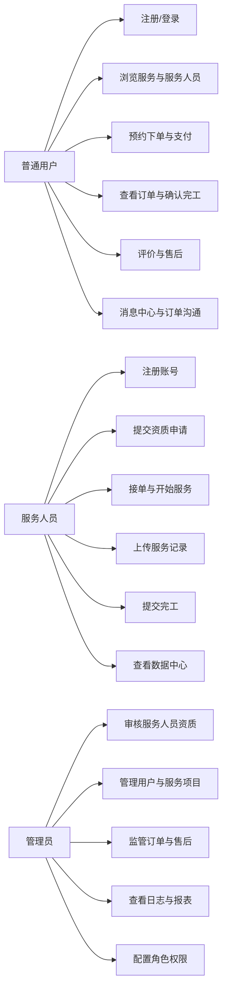
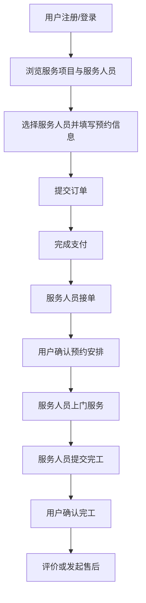
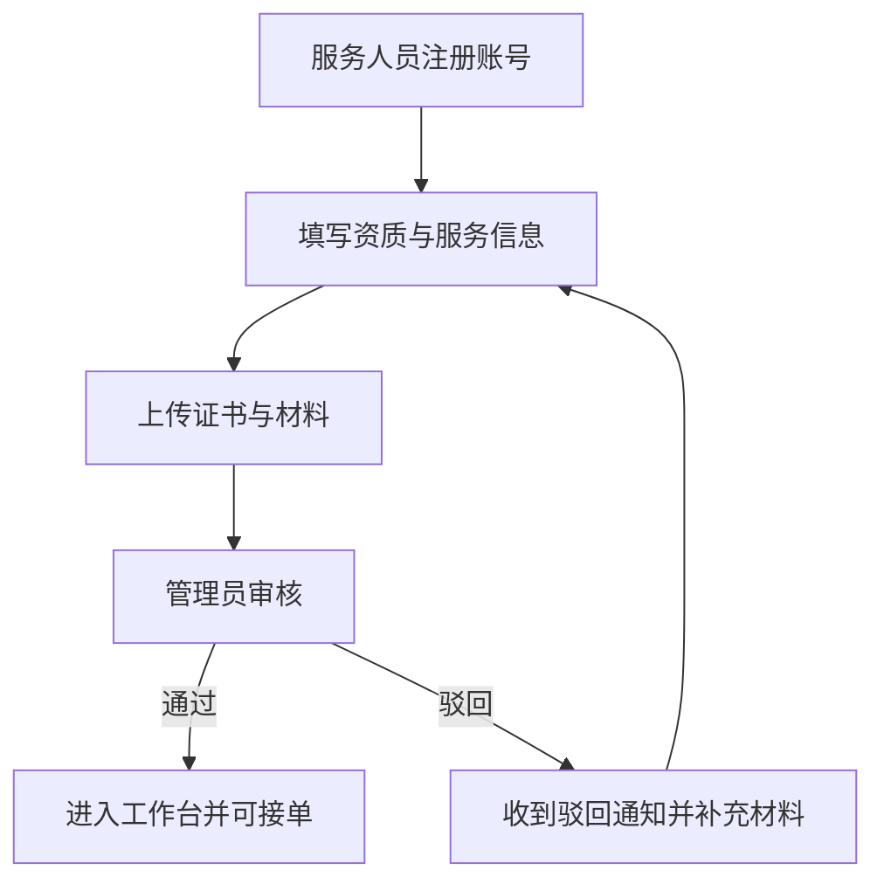
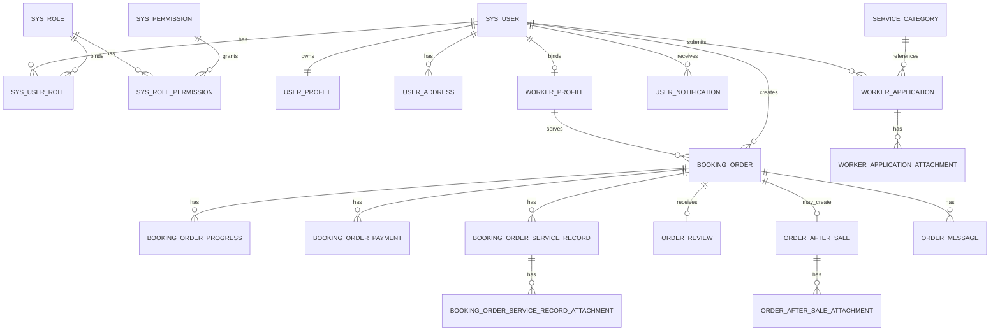

# 基于 Spring Boot 与 Vue 的家政服务预约系统的设计与实现

## 摘要

随着居民生活节奏的加快与平台经济的发展，家政服务逐渐从传统电话预约、熟人介绍模式转向在线预约、平台撮合与全过程信息化管理模式。传统家政服务在实际运行中普遍存在信息不透明、服务标准不统一、订单过程难跟踪、服务人员资质审核薄弱、售后处理滞后等问题，难以满足现代用户对于效率、安全与体验的综合要求。基于此，本文围绕家政服务预约场景，设计并实现了一套基于 Spring Boot 与 Vue 的家政服务预约系统。

本系统采用前后端分离的 B/S 架构，后端以 Spring Boot 为核心开发框架，结合 Spring Security、JWT、MyBatis-Plus 与 MySQL 实现认证授权、业务处理与数据持久化；前端采用 Vue 3、Vue Router、Element Plus、ECharts 与 Leaflet 构建多角色、可视化、地图选址的交互界面。系统围绕普通用户、服务人员、管理员三类角色展开，完成了用户注册登录、服务浏览、服务人员详情展示、在线预约、支付、订单协同履约、服务记录上传、评价反馈、售后处理、消息通知、资质审核、后台治理、数据中心与报表导出等功能，形成了较完整的业务闭环。

在系统实现过程中，本文重点解决了多角色权限隔离、服务人员资质审核后方可接单、订单由用户与服务人员协同推进、地图选址与地址簿管理、支付状态与履约过程联动、后台权限配置与日志审计等关键问题。测试结果表明，该系统能够较稳定地完成家政服务预约平台的核心业务流程，具备良好的可演示性、可扩展性与课程设计应用价值。

**关键词：** 家政服务预约；Spring Boot；Vue；MyBatis-Plus；MySQL；订单协同

## ABSTRACT

With the acceleration of urban life and the rapid development of platform-based services, housekeeping services are increasingly shifting from traditional phone booking and acquaintance referrals to online reservation, platform matching, and full-process digital management. Traditional housekeeping service models often suffer from poor information transparency, inconsistent service standards, limited order traceability, weak qualification management of workers, and inefficient after-sales handling. To address these issues, this paper designs and implements a housekeeping service reservation system based on Spring Boot and Vue.

The system adopts a front-end and back-end separated B/S architecture. The back end is built on Spring Boot and integrates Spring Security, JWT, MyBatis-Plus, and MySQL for authentication, authorization, business processing, and data persistence. The front end uses Vue 3, Vue Router, Element Plus, ECharts, and Leaflet to provide a multi-role, visualized, and map-enabled interactive interface. The system serves three roles: ordinary users, service workers, and administrators. It supports user registration and login, service browsing, worker profile display, online reservation, payment, collaborative order fulfillment, service record upload, review and feedback, after-sales processing, message notification, qualification audit, back-office governance, data dashboards, and report export, thus forming a relatively complete business closed loop.

During implementation, the system focuses on solving key issues such as multi-role permission isolation, qualification-based worker order acceptance, collaborative order progression by both users and workers, map-based address selection and address book management, linkage between payment status and service fulfillment, as well as background permission configuration and operation logging. Test results show that the system can stably complete the core business processes of a housekeeping reservation platform and has good demonstrability, extensibility, and practical value for graduation design.

**Key words:** housekeeping reservation; Spring Boot; Vue; MyBatis-Plus; MySQL; collaborative order workflow

## 目 录

- 第1章 前言
- 第2章 技术介绍
- 第3章 系统需求分析
- 第4章 系统设计
- 第5章 系统实现
- 第6章 系统测试
- 第7章 总结与展望
- 参考文献

---

## 第1章 前言

### 1.1 课题背景与意义

近年来，伴随生活服务平台的发展、移动支付的普及以及居民消费习惯的变化，家政服务行业正在逐步走向标准化、平台化和数字化。保洁、家电清洗、老人陪护、母婴护理、收纳整理等服务需求持续增长，但大量中小型家政服务机构仍然依赖线下介绍、电话沟通和手工登记完成业务流转，存在以下问题。

1. 用户难以直观比较不同服务人员的资质、评分、服务内容与价格。
2. 服务人员的入驻审核、材料管理与服务能力展示缺乏统一标准。
3. 订单过程缺少透明追踪，服务开始、服务完成、用户确认等关键节点容易产生争议。
4. 支付、评价、售后和通知等环节割裂，平台难以形成完整闭环。
5. 后台管理在用户管理、服务项目管理、资质审核、订单监管、报表导出等方面效率偏低。

基于以上问题，设计并实现一个家政服务预约系统具有明显的现实意义。一方面，系统能够为普通用户提供透明、可视化、可追踪的在线预约体验；另一方面，系统能够帮助服务人员通过平台统一展示能力并规范履约；同时，平台管理者也能够基于后台治理能力提升运营效率与服务质量。因此，基于 Spring Boot 与 Vue 技术构建家政服务预约系统，既具有较强的工程实践价值，也符合软件工程课程设计和毕业设计对于完整系统开发能力的要求。

### 1.2 国内外研究现状

从国外看，以 TaskRabbit 为代表的本地生活服务平台已经形成较成熟的撮合模式。此类平台通常具有服务分类导航、服务人员档案展示、订单预约、支付担保、评价反馈、通知沟通等功能，强调用户信任、流程透明和多角色协同。国外研究与实践普遍重视平台治理能力建设，包括服务标准化、人员审核、争议处理和数据分析能力。

从国内看，家政服务数字化平台也在快速发展，部分平台已具备预约、支付、服务评价等基础能力，但不少中小型系统仍停留在“展示型官网”或“单点管理系统”阶段，存在业务闭环不完整、权限控制粗放、售后与服务记录不足等问题。尤其在课程设计或教学项目中，常见系统多以基础增删改查为主，对服务人员资质审核、订单协同推进、地图选址、消息通知、后台权限配置等复杂业务考虑不足。

因此，面向家政服务预约场景，构建一个覆盖普通用户、服务人员、管理员三类角色，具备前后台协同、订单闭环、资质审核、支付与数据中心能力的综合平台，具有较好的研究和实践价值。

### 1.3 本课题研究的主要内容

本文以当前已经实现的家政服务预约平台为研究对象，围绕系统分析、设计、实现与测试展开，主要研究内容如下。

1. 分析家政服务预约业务的角色组成、业务流程和关键痛点，明确普通用户、服务人员与管理员三类角色的核心需求。
2. 结合当前项目实际实现情况，确定基于 Spring Boot、Spring Security、JWT、MyBatis-Plus、MySQL、Vue 3、Element Plus 与 ECharts 的技术方案。
3. 对系统进行整体架构设计、功能模块划分、数据库设计、订单状态机设计与权限模型设计。
4. 实现服务浏览、预约下单、支付、资质审核、订单协同履约、售后处理、消息中心、数据中心与后台治理等关键模块。
5. 对系统进行功能测试、可用性测试和构建验证，总结系统当前成果与待完善方向。

---

## 第2章 技术介绍

### 2.1 MySQL 数据库

MySQL 是当前 Web 系统中应用最广泛的关系型数据库之一，具备开源、稳定、高性能和部署方便等优点，适合中小型到中大型平台系统的数据存储需求。本系统将用户、角色、权限、地址簿、服务项目、服务人员、订单、支付、服务记录、售后、消息、通知和日志等核心业务数据统一存储在 MySQL 中。  
在实现上，MySQL 与 MyBatis-Plus 搭配使用，能够较高效地完成条件查询、分页查询、状态过滤以及统计汇总等操作，满足本系统多角色、多业务模块的数据管理需求。

### 2.2 B/S 结构

B/S 即 Browser/Server 结构，是当前最常见的 Web 应用架构模式。用户通过浏览器访问系统，前端负责页面展示与交互，后端负责业务处理与数据读写。  
本系统采用典型的前后端分离 B/S 结构，具有以下优点。

1. 用户无需安装专门客户端，只需通过浏览器即可访问系统。
2. 前端与后端职责清晰，便于多角色页面独立开发与后期维护。
3. 系统可扩展性较好，便于后续对接真实支付、对象存储和外部通知服务。
4. 系统更适合课程设计环境下的快速迭代和演示部署。

### 2.3 Spring Boot 框架

Spring Boot 是基于 Spring 体系构建的快速开发框架，具备自动配置、组件整合方便、生态完善等优点，适合用于企业级 Web 应用开发。  
本系统后端使用 Spring Boot 3.3.2 作为核心框架，在其基础上集成了 Spring Web、Spring Security、Spring Validation、JDBC、Knife4j 等组件，实现了 REST 接口开发、安全认证、参数校验与接口文档生成等功能。

### 2.4 Java 语言介绍

Java 具有面向对象、跨平台、生态成熟和企业级应用广泛等优点，适合作为本系统后端开发语言。当前项目使用 Java 17 作为运行环境，既能兼顾语言新特性，也能保证框架兼容性和部署稳定性。  
在系统开发中，Java 主要承担控制器接口实现、业务逻辑处理、权限控制、实体映射、初始化数据构建以及多模块协同等任务。

### 2.5 Vue 前端框架

Vue 3 是当前主流的现代化前端框架，具有组件化、渐进式、开发效率高和生态完善等特点。  
本系统前端使用 Vue 3 作为基础框架，并配合 Vue Router 进行多端路由划分，使用 Element Plus 构建表单与后台组件，使用 ECharts 实现图表可视化，使用 Leaflet 实现地图选址，从而完成普通用户端、服务人员端和管理后台的多角色界面开发。

### 2.6 其他关键技术

除上述核心技术外，本系统还使用了以下关键技术。

1. Spring Security：实现接口访问控制与角色权限拦截。
2. JWT：实现无状态认证，支持前后端分离场景下的身份保持。
3. MyBatis-Plus：负责 DAO 层与分页查询实现。
4. Element Plus：用于表单、表格、抽屉、对话框、分页等界面组件构建。
5. ECharts：用于管理员和服务人员数据中心的图表展示。
6. Leaflet + OpenStreetMap：用于地图选址与地址经纬度回填。
7. Knife4j：用于接口调试和 API 文档展示。

---

## 第3章 系统需求分析

### 3.1 系统可行性分析

#### 3.1.1 技术可行性

本系统所采用的技术栈均为成熟的主流开源技术，具有较高的技术可行性。后端方面，Spring Boot 与 Spring Security 能够较稳定地支持多角色认证授权；MyBatis-Plus 与 MySQL 能够满足数据持久化与分页统计需求；JWT 适用于前后端分离项目的身份验证。前端方面，Vue 3、Element Plus、ECharts 与 Leaflet 都拥有完善文档与社区支持，便于在课程设计周期内实现较完整的页面交互效果。因此，从技术实现角度看，本课题具备较高可行性。

#### 3.1.2 经济可行性

本系统开发所使用的核心框架和组件均为开源软件，不需要额外授权成本，开发环境可基于个人计算机、本地 MySQL 和浏览器完成部署。对于教学项目和毕业设计而言，开发与运行成本较低，经济可行性较高。即使后续需要扩展为真实商业系统，也可以在现有架构基础上逐步增加对象存储、短信服务和支付网关，不需要推翻重构。

#### 3.1.3 操作可行性

本系统采用浏览器访问模式，普通用户、服务人员与管理员均可通过统一入口登录进入各自工作台。前端页面围绕预约、支付、审核、订单协同和后台治理进行功能分组，操作路径清晰，适合非技术用户使用。系统还通过状态标签、数据中心图表、通知与消息中心等方式提高信息可读性，因此具有较好的操作可行性。

### 3.2 系统用例分析

系统主要包含普通用户、服务人员、管理员三类参与者，其核心用例如下图所示。



从业务角度看，系统的关键特征在于：服务人员虽然可以直接注册账号，但在资质审核通过前不能接单；订单状态推进也不是由单一角色完成，而是由用户与服务人员协同推进，这使得系统业务更加贴近真实平台运行模式。

### 3.3 系统流程分析

#### 3.3.1 用户预约服务流程



#### 3.3.2 服务人员资质与接单流程



#### 3.3.3 后台治理流程

管理员通过后台对用户、服务项目、订单、售后、通知、日志和权限进行统一管理。后台的数据中心为运营管理提供订单数量、营业额、支付情况、订单状态结构和服务成交结构等统计信息；后台治理流程能够帮助平台快速识别异常订单、待审核资质和售后工单，提升平台管理效率。

---

## 第4章 系统设计

### 4.1 系统功能设计

依据当前系统实现情况，可将系统划分为 12 个一级功能模块。

1. 账号认证与权限管理模块  
2. 门户首页与服务展示模块  
3. 用户中心模块  
4. 地图选址与地址管理模块  
5. 服务预约与支付模块  
6. 订单协同履约模块  
7. 服务人员资质申请模块  
8. 服务人员工作台模块  
9. 消息中心与订单沟通模块  
10. 售后与评价模块  
11. 管理后台治理模块  
12. 数据中心与统计分析模块

从页面组织方式看，前端采用多端布局隔离设计，包括公开门户、认证页、用户工作台、服务人员工作台与管理后台五类布局，保证不同角色页面结构和权限边界清晰。

### 4.2 系统数据库分析

系统数据库围绕“用户、角色、服务项目、服务人员、订单、支付、售后、消息、日志”展开设计。数据库的核心目标有三点。

1. 支持三类角色和细粒度权限控制。
2. 支持订单从预约到履约、支付、评价、售后全过程追踪。
3. 支持服务人员资质审核、通知消息和后台治理分析。

数据库采用关系型模型，主键普遍使用自增 `BIGINT`，便于扩展与关联。订单、售后、日志、消息等表均记录创建时间和状态字段，以支持后台查询、分页与统计分析。

### 4.3 数据库概念模型设计

系统的主要实体关系如下图所示。



### 4.4 数据库表的设计

根据当前数据库脚本，系统的关键数据表如下。

| 表名 | 作用说明 |
| --- | --- |
| `sys_user` | 存储系统用户账号，支持手机号和用户名登录 |
| `sys_role` | 存储角色信息 |
| `sys_user_role` | 用户与角色关联 |
| `sys_permission` | 权限元数据 |
| `sys_role_permission` | 角色与权限关联 |
| `user_profile` | 用户扩展资料 |
| `user_address` | 用户地址簿，支持经纬度 |
| `service_category` | 服务项目分类及展示信息 |
| `worker_profile` | 服务人员服务档案 |
| `worker_application` | 服务人员资质申请 |
| `worker_application_attachment` | 资质申请附件 |
| `booking_order` | 订单主表 |
| `booking_order_payment` | 订单支付记录 |
| `booking_order_progress` | 订单状态进度 |
| `booking_order_service_record` | 服务过程记录 |
| `booking_order_service_record_attachment` | 服务记录附件 |
| `order_review` | 订单评价 |
| `order_after_sale` | 售后工单 |
| `order_after_sale_attachment` | 售后附件 |
| `favorite_worker` | 用户收藏服务人员 |
| `user_notification` | 站内通知 |
| `order_message` | 订单沟通消息 |
| `operation_log` | 后台操作日志 |

### 4.5 订单状态机设计

当前系统订单状态设计如下。

1. `PENDING`：待接单  
2. `ACCEPTED`：已接单  
3. `CONFIRMED`：用户已确认  
4. `IN_SERVICE`：服务中  
5. `WAITING_USER_CONFIRMATION`：待用户确认完工  
6. `COMPLETED`：已完成

这一状态设计体现了“用户与服务人员共同推进订单”的业务思想。服务人员不能单方面把订单直接推进到完成状态，必须经过用户确认预约安排、用户确认完工等关键节点，从而提升交易透明度和争议可追踪性。

---

## 第5章 系统实现

### 5.1 前台功能实现

#### 5.1.1 系统首页页面

系统首页承担门户展示和服务引导作用。页面展示热门服务项目、推荐服务人员、分类导航和平台入口，服务项目与服务人员均支持图片展示，整体界面采用卡片式布局。  
用户可从首页直接进入服务人员列表和预约流程，降低操作路径长度。首页的设计重点在于信息简洁、入口明确、信任感强，符合在线预约平台的使用习惯。

#### 5.1.2 服务人员浏览与预约页面

服务人员列表页面支持按服务类型筛选，并显示服务人员头像、评分、完单量、价格、可预约时间和标签信息。详情页面进一步展示服务范围、从业年限、证书信息、服务案例和用户关注点。  
预约页面采用表单化方式输入预约信息，用户需要填写联系人、电话、服务地址、预约日期和具体时间段。系统可预约时段以具体时间段形式展示，并支持地图选址与地址簿复用，提高填写效率。

#### 5.1.3 用户中心功能实现

用户中心包括个人资料、地址簿、收藏列表、订单列表、消息中心、订单沟通和数据看板等页面。  
个人资料页面支持头像上传、城市选择、简介维护；地址簿页面支持地图搜索或点击选点，并保存经纬度；收藏模块支持对服务人员进行收藏与取消收藏；消息中心与订单沟通已分离为两个独立侧边栏选项，使信息结构更加清晰。

#### 5.1.4 订单与支付功能实现

用户提交订单后，系统会生成订单记录并显示支付入口。支付模块已实现演示型支付闭环，支持支付状态展示、支付记录保存与后续订单流转联动。  
订单列表当前只展示摘要信息，详细信息通过当前页面的抽屉展开，避免页面信息过载。用户可以在订单详情中查看预约信息、支付状态、进度记录、服务记录、评价和售后入口。

### 5.2 服务人员功能实现

#### 5.2.1 服务人员注册与资质申请

服务人员可以直接注册账号，但注册时只填写账号基础信息。具体服务信息、服务范围、从业年限、资质证书、材料附件等内容统一放在资质申请页面填写。  
这一设计将“账号注册”与“从业资质申报”解耦，使流程更加清晰，也更符合真实业务。

#### 5.2.2 资质审核与接单限制

系统明确规定：服务人员在资质审核通过前不能接单、不能开始服务、不能上传服务记录、不能提交完工。  
在前端，未审核通过的服务人员工作台只显示资质相关入口；在后端，订单接口也会再次校验资质状态，从而保证业务规则不被绕过。

#### 5.2.3 服务人员工作台与数据中心

服务人员工作台包含数据中心、订单处理、消息中心、订单沟通和资质材料等功能。  
数据中心展示总订单、待接单、服务中、待用户确认、营业额、今日流水、本月流水、已支付订单等统计卡片，并通过图表展示订单状态结构和服务成交结构。为了避免图表拥挤，状态分布图采用圆环图加右侧图例的方式，提升可读性。

#### 5.2.4 服务过程记录实现

服务人员在服务过程中可上传签到记录、过程照片和完工凭证，系统将这些数据保存为服务记录及其附件，供用户在订单详情中查看。  
服务记录机制不仅增强了履约透明度，也为用户确认完工和售后争议处理提供依据。

### 5.3 管理员功能实现

#### 5.3.1 后台看板与用户管理

管理员后台包含运营看板、用户管理、服务项目管理、资质审核、订单监管、售后处理、操作日志、报表导出和权限配置等功能。  
用户管理支持按姓名、手机号、角色和状态筛选，查看是否已绑定服务档案，并可进行编辑和逻辑管理。

#### 5.3.2 服务项目管理

服务项目管理支持维护项目名称、价格标签、服务时长、服务范围、适用场景、增值服务与展示图片。  
为了提高表单易用性，系统没有全部使用纯文本框，而是针对字段类型采用更适合的输入组件，例如可创建选择框、多选标签和图片上传等，从而减少录入错误并提升管理效率。

#### 5.3.3 资质审核、订单监管与售后处理

资质审核页面可查看服务人员提交的证书文件和相关信息，管理员可执行通过或驳回操作。审核结果会以站内通知形式反馈给服务人员，并带有对应的跳转路径。  
订单监管页面支持查看订单状态、支付状态、服务记录和摘要信息。售后页面支持查看工单内容、证据附件和处理结果。通过这些页面，管理员能够较完整地覆盖平台核心治理任务。

#### 5.3.4 权限配置与操作日志

系统已实现角色权限配置页面，管理员可以对普通用户、服务人员和管理员的权限进行中文化配置。后台接口同时记录关键操作日志，包括订单处理、审核操作、权限修改和服务项目维护等，便于后续审计和责任追踪。

---

## 第6章 系统测试

### 6.1 测试目的

系统测试的主要目的在于验证当前家政服务预约系统是否满足设计阶段提出的核心需求，包括：

1. 各角色是否能够正常完成各自业务流程。
2. 订单、支付、资质审核、消息通知等关键模块能否正常联动。
3. 系统界面、接口与数据持久化逻辑是否稳定。
4. 当前系统是否能够支撑课程设计与毕业答辩演示。

### 6.2 测试方法

本系统主要采用以下测试方法。

1. 功能测试：按业务流程逐步验证各模块功能是否正常。
2. 接口测试：通过 Knife4j/Swagger 对接口进行调试验证。
3. 构建测试：分别执行前后端构建命令，验证工程可编译性。
4. 可用性测试：从多角色页面交互角度检查页面布局、表单输入和提示信息是否合理。

### 6.3 测试过程

#### 6.3.1 功能测试

| 测试模块 | 测试内容 | 预期结果 | 测试结果 |
| --- | --- | --- | --- |
| 用户注册登录 | 用户可通过手机号或用户名登录 | 正常登录并跳转对应工作台 | 通过 |
| 服务浏览 | 查看服务项目和服务人员详情 | 页面正常展示并支持筛选 | 通过 |
| 地图选址 | 地图搜索与点击选点设置地址 | 地址、城市、经纬度回填成功 | 通过 |
| 在线预约 | 用户选择日期和具体时间段提交订单 | 订单创建成功 | 通过 |
| 支付功能 | 用户对订单完成演示支付 | 支付状态更新为已支付 | 通过 |
| 资质审核 | 服务人员提交资质后管理员审核 | 审核结果反馈到服务人员端 | 通过 |
| 接单限制 | 未通过资质审核的服务人员尝试接单 | 后端拦截并提示不可接单 | 通过 |
| 服务记录 | 服务人员上传签到和过程图片 | 记录可在订单详情中查看 | 通过 |
| 售后处理 | 用户发起售后并上传凭证 | 管理员可查看并处理 | 通过 |
| 通知消息 | 一键全部标记已读 | 未读通知清零 | 通过 |
| 权限配置 | 管理员调整角色权限 | 菜单和访问权限同步变化 | 通过 |

#### 6.3.2 可用性测试

系统对表单输入、图表展示和详情展示做了专项优化。

1. 登录页改为横向结构，减少冗余介绍信息，聚焦登录操作。
2. 城市、服务类型、服务范围等字段采用选择框、可创建标签等更合理的组件，降低用户输入成本。
3. 订单详情采用当前页面抽屉展开，避免频繁跳转页面。
4. 消息中心与订单沟通分离为独立导航入口，信息结构更清晰。
5. 数据中心页面采用紧凑卡片布局和简化图表，提升一屏可读性。

#### 6.3.3 构建与运行验证

在当前项目环境中，系统已通过以下构建验证。

```powershell
cd backend/housekeeping-server
mvn -q -DskipTests package
```

```powershell
cd frontend/web
npm run build
```

构建结果表明，前后端工程均能够成功编译打包。后端基于 MySQL 运行，前端通过 Vite 构建，能够满足演示环境下的部署需求。

### 6.4 测试结果

综合测试结果表明，当前家政服务预约系统已经实现了较完整的业务闭环，普通用户、服务人员与管理员三类角色均可完成主要业务流程。系统在功能完整性、界面交互性、权限控制和可演示性方面达到了预期目标，能够满足课程设计和毕业设计答辩要求。

同时，测试中也发现系统仍存在进一步提升空间。

1. 支付模块目前为演示型支付流程，尚未接入微信或支付宝真实网关。
2. 文件上传目前采用本地存储，后续可扩展为对象存储。
3. 自动化测试尚未系统化建设，后续可补充单元测试与集成测试。
4. 前端体积仍可继续优化，尤其是 Element Plus 与 ECharts 的按需加载和分包策略。

---

## 第7章 总结与展望

本文围绕家政服务预约场景，设计并实现了一套基于 Spring Boot 与 Vue 的家政服务预约系统。系统从真实平台业务出发，完成了用户注册登录、服务浏览、预约支付、资质审核、订单协同履约、服务记录、评价售后、通知沟通、后台治理和数据中心等核心功能，较好地实现了三类角色在同一平台中的协同运行。

与传统教学项目中常见的简单增删改查系统相比，本文系统在以下方面具有较强实践意义。

1. 采用多角色隔离与 JWT 权限控制，贴近真实平台系统。
2. 强调服务人员资质审核与接单资格联动，符合家政行业管理特点。
3. 订单状态由用户与服务人员共同推进，增强了履约透明度。
4. 集成支付、地图选址、消息通知、售后和报表，业务闭环更完整。
5. 前端采用多工作台布局与数据可视化设计，具备较好的演示效果。

未来可从以下几个方面继续完善。

1. 接入真实支付网关，实现微信支付或支付宝沙箱环境支付。
2. 接入短信、邮件或微信模板消息，实现外部通知提醒。
3. 将本地文件存储升级为对象存储，提升部署能力。
4. 增加自动化测试、持续集成和更完整的性能测试。
5. 引入智能推荐、服务排班优化和数据分析能力，进一步增强平台价值。

总体来看，本文所实现的家政服务预约系统已经具备较完整的功能体系和良好的扩展基础，能够作为一个具有代表性的 Web 应用毕业设计项目。

---

## 参考文献

[1] Spring Boot 官方文档. https://spring.io/projects/spring-boot  
[2] Spring Security 官方文档. https://spring.io/projects/spring-security  
[3] Vue.js 官方文档. https://vuejs.org/  
[4] MyBatis-Plus 官方文档. https://baomidou.com/  
[5] MySQL Reference Manual. https://dev.mysql.com/doc/  
[6] Jones M, Bradley J, Sakimura N. JSON Web Token (JWT). RFC 7519.  
[7] Element Plus 官方文档. https://element-plus.org/  
[8] Apache ECharts 官方文档. https://echarts.apache.org/  
[9] Leaflet 官方文档. https://leafletjs.com/  
[10] Sommerville I. Software Engineering. Pearson.  
